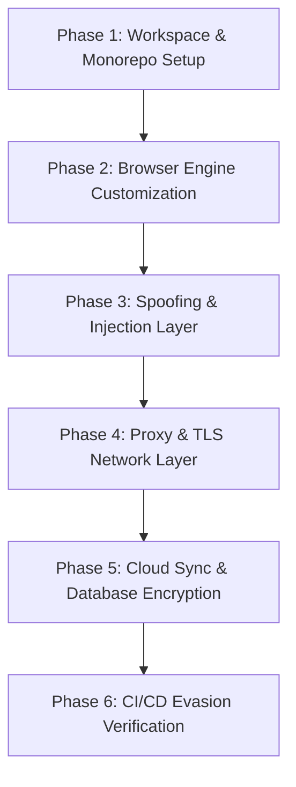

# Anti-Detect Browser Production Build & Engineering Blueprint

This skill contains the step-by-step blueprint and implementation guidelines to construct a production-ready **Anti-Detect Browser** product utilizing the core modules of this `fingerprint-suite` workspace.

---

## 1. Phase-by-Phase Implementation Blueprint

Building a production-grade anti-detect browser involves 6 key development phases. Below is the detailed breakdown of what to do in each step:

### Phase 1: Workspace & Monorepo Setup
*   **Action**: Set up a `pnpm` monorepo workspace.
*   **Goal**: Decouple the GUI application (Frontend) from the browser automation and fingerprinting libraries (Backend).
*   **Steps**:
    1. Organize your project into `apps/desktop-client` (Electron/React), `apps/cloud-api` (NestJS/Go Backend), and `packages/` (reusable engines like `fingerprint-core`, `browser-launcher`).
    2. Share TypeScript typings between backend and frontend to ensure API contracts (like profile configurations and sync schemas) are validated at compile-time.

### Phase 2: Browser Engine Customization
To prevent anti-bot detectors from identifying your automated browsers:
*   **MVP Approach (JS Overrides)**: Launch chromium using Playwright/Puppeteer, disabling default automation flags (like `useAutomationExtension: false`, `--disable-blink-features=AutomationControlled`).
*   **Enterprise-Grade (Chromium C++ Fork)**:
    1. Fork Chromium (e.g., version 120+).
    2. Locate WebGL rendering logic in `third_party/blink/renderer/modules/webgl/webgl_rendering_context_base.cc` and patch the vendor/renderer string directly.
    3. Modify canvas pixel buffer extraction in `third_party/blink/renderer/core/html/canvas/canvas_rendering_context.cc` to add a tiny, deterministic noise offset unique to each profile.
    4. Compile the custom binary (e.g., naming it *Mimic* or *Orbita*) and store it locally.

### Phase 3: Spoofing & Injection Layer
If using JS overrides, ensure your injection logic is robust:
*   **Canvas Fingerprint Spoofing**: Overwrite `HTMLCanvasElement.prototype.getContext`, `toDataURL`, and `getImageData` using Proxies. Introduce subtle, consistent noise to the pixel data based on a hash of the profile ID so the hash is unique but constant for that profile.
*   **WebGL Spoofing**: Intercept `WebGLRenderingContext.prototype.getParameter` to return the hardware GPU details from the generated fingerprint.
*   **AudioContext Spoofing**: Override `AudioBuffer.prototype.copyFromChannel` and `AudioContext.prototype.createAnalyser` to add imperceptible noise to audio buffers.
*   **toString Protection**: Inject [redirectToString](file:///c:/Users/Phucx/Desktop/fingerprint-suite/packages/fingerprint-injector/src/utils.js#L129) to clean up Function toString outputs, hiding proxy structures.

### Phase 4: Proxy & TLS Network Layer
*   **IP Isolation**: Every profile must route its traffic through a dedicated proxy (SOCKS5/HTTP).
*   **Proxy Verification**: Write a pre-launch script to check proxy latency and connectivity. If it fails, abort launching to prevent leaking the user's home IP address.
*   **TLS/JA3/JA4 Fingerprint Matching**: Customize the TLS handshake signature. Standard Playwright/Node TLS Client Hello handshakes are immediately flagged by Cloudflare. Use proxy interceptors or modified network stacks to match Chrome's TLS cipher suites, extensions order, and ALPN.

### Phase 5: Cloud Sync & Profile Encryption
*   **Master Password Encryption**: Derive an encryption key on the frontend using PBKDF2/Argon2 from the user's master password.
*   **Local Encryption**: Encrypt the profile's SQLite DB, cookies, local storage, and history locally (AES-GCM-256) before uploading them to the Cloud API database. The API server should never see the decrypted profile cookies.
*   **Incremental Syncing**: Implement delta-syncing. Instead of uploading the entire cache/cookie files (which can be gigabytes), only sync diff files after a profile session closes.

### Phase 6: CI/CD Evasion Verification
*   Integrate automation checks against fingerprint testers:
    *   **CreepJS**: Ensure trust score is close to 100%. No "lies" detected on prototypes.
    *   **Pixelscan / Iphey**: Verify that all browser properties (screen, plugins, WebGL, timezone) are flagged as "natural".
*   Set up a nightly test suite that launches 10 dummy profiles to bypass Cloudflare Turnstile and Datadome. Track the success rate on a dashboard.
