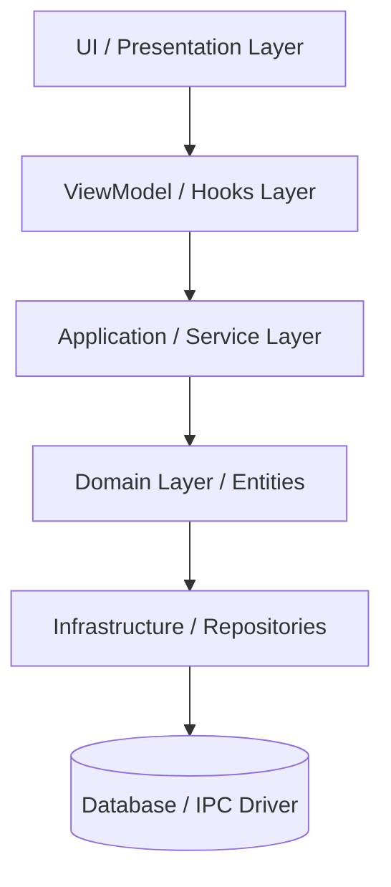

# Senior Architecture Principles & Design Blueprint

Bộ quy chuẩn này định nghĩa các nguyên lý thiết kế hệ thống tối thượng dành cho các dự án phần mềm quy mô lớn (như Antidetect Browser, VS Code, Discord, POS, ERP...). Nó đóng vai trò là "Sách Thánh" hướng dẫn các kỹ sư phần mềm và AI Code Agent xây dựng hệ thống sạch, có khả năng mở rộng tối đa, dễ bảo trì, dễ sửa chữa và tái sử dụng code ở mức cao nhất.

---

## 1. Mười Tám (20) Tư Duy Thiết Kế Hệ Thống Cốt Lõi

### 1. Phân Tầng Hệ Thống (Layering Architecture)
**Nguyên tắc**: Tuyệt đối không bao giờ để một tầng thực hiện công việc của tầng khác. Các tầng chỉ giao tiếp trực tiếp với tầng ngay dưới nó.
- **UI (Presentation)**: Chỉ hiển thị dữ liệu và nhận sự kiện người dùng.
- **ViewModel / Hooks**: Quản lý trạng thái giao diện, định hình luồng dữ liệu view.
- **Application (Service)**: Điều phối các quy trình nghiệp vụ (Business Logic).
- **Domain (Entity/Model)**: Đại diện cho các thực thể cốt lõi và luật nghiệp vụ bất biến.
- **Infrastructure (Repository/Driver)**: Giao tiếp với thế giới bên ngoài (Database, Network, File System, Electron IPC).
- **Database / Hardware**: Nơi lưu trữ dữ liệu vật lý.



#### ❌ Code Tệ (Junior)
```tsx
// Giao diện gọi trực tiếp câu lệnh truy vấn dữ liệu / SQLite
export function ProfileButton({ id }) {
  const handleLaunch = async () => {
    const db = await sqlite.open();
    await db.run('UPDATE profiles SET status = "running" WHERE id = ?', id);
    window.ipcRenderer.send('launch-browser', id);
  };
  return <button onClick={handleLaunch}>Launch</button>;
}
```

#### ✅ Code Chuẩn (Senior)
```tsx
// UI Component
export function ProfileButton({ id }: { id: string }) {
  const { launch } = useProfileMutations(); // Đi qua Hook (ViewModel)
  return <button onClick={() => launch(id)}>Launch</button>;
}

// Hook (ViewModel)
export function useProfileMutations() {
  const profileService = useProfileService();
  return {
    launch: (id: string) => profileService.launchProfile(id), // Gọi Service
  };
}

// Service (Application Layer)
export class ProfileService {
  constructor(private repo: ProfileRepository, private launcher: BrowserLauncher) {}

  async launchProfile(id: string): Promise<void> {
    const profile = await this.repo.findById(id); // Gọi Repository
    await this.launcher.launch(profile);
    profile.status = 'running';
    await this.repo.save(profile);
  }
}
```

---

### 2. Trách Nhiệm Đơn Lẻ (Single Responsibility Principle)
**Nguyên tắc**: Một file/component chỉ chịu trách nhiệm giải quyết duy nhất một bài toán. Nếu một file vượt quá 300 - 500 dòng code, hãy tìm cách chia nhỏ nó ngay lập tức.
- **Page Component**: Chỉ làm nhiệm vụ điều phối và ráp nối (Compose) các thành phần giao diện.
- **Sub-components**: Chỉ render một phần nhỏ UI (Toolbar, Table, Footer...).

#### ❌ Code Tệ (Junior)
Một file `ProfilesPage.tsx` gộp chung logic tải dữ liệu, bộ lọc, phân trang, vẽ khung toolbar, vẽ bảng, vẽ hàng, vẽ popup menu, ghi log, gọi API... (1.600+ dòng).

#### ✅ Code Chuẩn (Senior)
```tsx
// ProfilesPage.tsx chỉ Compose các dumb component
export function ProfilesPage(): JSX.Element {
  const { profiles, isLoading } = useProfilesQuery();
  const { activeTab, setActiveTab } = useProfilesTableState();
  const { tabConfig, tabCounts, paginatedProfiles } = useProfilesViewModel({ profiles, activeTab });

  return (
    <ProfilesWorkspaceShell
      tabs={<ProfilesTabs activeTab={activeTab} counts={tabCounts} onChange={setActiveTab} />}
      toolbar={<ProfilesToolbar actions={tabConfig.toolbarActions} />}
      table={<ProfilesDataTable rows={paginatedProfiles} columns={tabConfig.columns} loading={isLoading} />}
      pagination={<ProfilesPagination />}
      modals={<ModalsContainer />}
    />
  );
}
```

---

### 3. Luồng Dữ Liệu Một Chiều (Single-Direction Data Flow)
**Nguyên tắc**: Dữ liệu luôn di chuyển theo luồng một chiều từ nơi lưu trữ lên giao diện hiển thị, và các hành động (Mutations) đi theo chiều ngược lại. Hãy luôn vẽ ra bản đồ:
`Data Source` ➔ `Repository` ➔ `Service` ➔ `State Sync` ➔ `ViewModel Hook` ➔ `Pure Render Component`.

---

### 4. Cấu Hình Lớn Hơn Rẽ Nhánh (Configuration over If-Else)
**Nguyên tắc**: Hạn chế tối đa việc viết các câu lệnh `if (activeTab === 'trash')` hay `if (activeTab === 'favorite')` rải rác khắp nơi trong UI. Tạo ra một Registry cấu hình tập trung (Tab Registry) và render giao diện dựa trên cấu hình đó.

#### ❌ Code Tệ (Junior)
```tsx
// Bảng tự rẽ nhánh hiển thị theo Tab
export function Table({ activeTab, data }) {
  return (
    <table>
      <thead>
        <tr>
          {activeTab === 'trash' ? (
            <>
              <th>Profile Info</th>
              <th>Delete Record</th>
            </>
          ) : (
            <>
              <th>Serial No.</th>
              <th>Profile Name</th>
            </>
          )}
        </tr>
      </thead>
      {/* Table Body... */}
    </table>
  );
}
```

#### ✅ Code Chuẩn (Senior)
```typescript
// Cấu hình Registry tập trung (profileTabConfigs.ts)
export const profileTabConfigs: Record<TabId, TabConfig> = {
  profiles: {
    id: 'profiles',
    label: 'Profiles',
    columns: defaultProfileColumns, // Cấu hình cột riêng
    emptyState: { title: 'No Profiles', description: 'Create your first profile.' }
  },
  trash: {
    id: 'trash',
    label: 'Trash',
    columns: trashProfileColumns, // Cấu hình cột riêng cho Trash
    emptyState: { title: 'No Data in Trash', description: 'Trash is empty.' }
  }
};

// Component bảng sử dụng chung (ProfilesDataTable.tsx)
export function ProfilesDataTable({ rows, columns, emptyState }) {
  return (
    <table>
      <thead>
        <tr>
          {columns.map(col => <th key={col.id}>{col.label}</th>)}
        </tr>
      </thead>
      <tbody>
        {rows.map(row => (
          <tr key={row.id}>
            {columns.map(col => <td key={col.id}>{col.render(row)}</td>)}
          </tr>
        ))}
      </tbody>
    </table>
  );
}
```

---

### 5. Thiết Kế Hướng Dữ Liệu (Data-Driven UI)
**Nguyên tắc**: Đừng code cứng (hardcode) các thành phần giao diện lặp lại. Định nghĩa chúng dưới dạng mảng dữ liệu (Array of Objects) và dùng các hàm duyệt mảng như `.map()` để render.

#### ❌ Code Tệ (Junior)
```tsx
return (
  <div className="share-menu">
    <button onClick={() => share('fb')}><FacebookIcon /> Facebook</button>
    <button onClick={() => share('gg')}><GoogleIcon /> Google</button>
    <button onClick={() => share('az')}><AmazonIcon /> Amazon</button>
  </div>
);
```

#### ✅ Code Chuẩn (Senior)
```tsx
const SHARE_PROVIDERS = [
  { id: 'fb', label: 'Facebook', Icon: FacebookIcon },
  { id: 'gg', label: 'Google', Icon: GoogleIcon },
  { id: 'az', label: 'Amazon', Icon: AmazonIcon },
] as const;

return (
  <div className="share-menu">
    {SHARE_PROVIDERS.map(({ id, label, Icon }) => (
      <button key={id} onClick={() => share(id)}>
        <Icon size={16} />
        <span>{label}</span>
      </button>
    ))}
  </div>
);
```

---

### 6. Pipeline Xử Lý Tuyến Tính (Filtering & Transforming Pipeline)
**Nguyên tắc**: Các bước lọc dữ liệu, tìm kiếm, sắp xếp và phân trang phải được tách thành các hàm tuần tự (Pipeline). Tránh viết gộp tất cả logic vào một biểu thức phức tạp.

```
Dữ Liệu Thô (Raw Profiles)
   ➔ Lọc theo Tab (Tab Filter)
   ➔ Tìm kiếm từ khóa (Search Keyword)
   ➔ Bộ lọc nâng cao (Advanced Filters)
   ➔ Sắp xếp (Sorting)
   ➔ Phân trang (Pagination)
   ➔ Kết quả hiển thị (Rendered Data)
```

```typescript
// useProfilesViewModel.ts
const tabProfiles = useMemo(() => profiles.filter(tabConfig.filter), [profiles, tabConfig]);
const searchedProfiles = useMemo(() => applySearch(tabProfiles, search), [tabProfiles, search]);
const sortedProfiles = useMemo(() => sortProfiles(searchedProfiles, sort), [searchedProfiles, sort]);
const paginatedProfiles = useMemo(() => paginate(sortedProfiles, page, size), [sortedProfiles, page, size]);
```

---

### 7. Tách Biệt Nghiệp Vụ Khỏi Giao Diện (ViewModel Separation)
**Nguyên tắc**: UI Component không được biết về cơ sở dữ liệu vật lý (SQLite, PostgreSQL, Supabase...) hay chi tiết cách thực thi của thư viện automation (Playwright/Puppeteer). Component chỉ nhận các biến trạng thái giao diện nguyên thủy (`title`, `icon`, `status`) và các callbacks hành động.

---

### 8. Khai Báo Bộ Đăng Ký (Registry Pattern)
**Nguyên tắc**: Bất kỳ thực thể hay nhóm logic nào lặp lại từ 3 lần trở lên đều phải đưa về dạng Registry tập trung (ví dụ: `browserRegistry`, `proxyRegistry`, `tabRegistry`). Điều này giúp cho việc bổ sung thêm một đối tượng mới trong tương lai chỉ cần thay đổi tệp cấu hình mà không phải viết lại code điều khiển.

---

### 9. Chiến Lược Thực Thi (Strategy Pattern)
**Nguyên tắc**: Khi hệ thống có nhiều thuật toán xử lý cùng một nghiệp vụ dựa trên điều kiện, hãy sử dụng Strategy Pattern thay vì rải rác câu lệnh rẽ nhánh.

#### ❌ Code Tệ (Junior)
```typescript
class ProxyChecker {
  async check(proxy: Proxy) {
    if (proxy.protocol === 'http') {
      // Logic HTTP check
    } else if (proxy.protocol === 'socks5') {
      // Logic SOCKS5 check
    } else if (proxy.protocol === 'ssh') {
      // Logic SSH tunnel check
    }
  }
}
```

#### ✅ Code Chuẩn (Senior)
```typescript
interface ProxyCheckStrategy {
  check(proxy: Proxy): Promise<boolean>;
}

class HttpProxyStrategy implements ProxyCheckStrategy {
  async check(proxy: Proxy) { /* ... */ return true; }
}

class Socks5ProxyStrategy implements ProxyCheckStrategy {
  async check(proxy: Proxy) { /* ... */ return true; }
}

// Registry các strategy
const proxyStrategies: Record<string, ProxyCheckStrategy> = {
  http: new HttpProxyStrategy(),
  socks5: new Socks5ProxyStrategy(),
};

class ProxyService {
  async checkProxy(proxy: Proxy) {
    const strategy = proxyStrategies[proxy.protocol];
    if (!strategy) throw new Error('Unsupported protocol');
    return strategy.check(proxy);
  }
}
```

---

### 10. Ưu Tiên Thành Phần Hóa (Composition over Inheritance)
**Nguyên tắc**: Xây dựng hệ thống bằng cách lắp ghép các thành phần nhỏ, độc lập (Composition) thay vì tạo ra các lớp cha/lớp con kế thừa sâu hoặc viết các Component khổng lồ.

---

### 11. Thành Phần UI Tái Sử Dụng (Shared UI Components)
**Nguyên tắc**: Các thành phần hiển thị mang tính phổ quát (`EmptyState`, `Table`, `Modal`, `Tooltip`, `Badge`, `Avatar`, `Button`) phải được đặt ở thư mục dùng chung (`src/renderer/components/ui/` hoặc `shared/components/`) để các trang và tính năng khác có thể gọi lại ngay lập tức mà không viết lại CSS.

---

### 12. Tập Trung Vào Domain Nghiệp Vụ Trước (Domain-First Design)
**Nguyên tắc**: Khi phát triển một tính năng mới, hãy thiết kế các thực thể Domain (Project, Profile, Proxy, Member, License) và các quy tắc hoạt động của chúng trước tiên. Giao diện (UI) chỉ là lớp hiển thị ngoài cùng của Domain.

---

### 13. Làm Rõ Chủ Sở Hữu Trạng Thế (State Ownership)
**Nguyên tắc**: Xác định rõ ràng phạm vi của từng loại dữ liệu và nơi quản lý nó:
- **Server/Local DB State**: Quản lý bằng các thư viện Cache (như TanStack Query).
- **Global App State**: Trạng thái người dùng, cấu hình ngôn ngữ, theme (React Context / Redux / Zustand).
- **Page State**: Tìm kiếm, phân trang, bộ lọc (useState của trang hoặc URL query params).
- **Ephemeral Input State**: Ký tự đang nhập trong ô Input (useState cục bộ của ô Input).

---

### 14. Hướng Phụ Thuộc Luôn Đi Xuống (Dependency Direction)
**Nguyên tắc**: Các tệp tin ở tầng trên có quyền import và phụ thuộc vào các tệp ở tầng dưới, tuyệt đối không được đi ngược lại.
`UI / Page` ➔ `ViewModel Hook` ➔ `Service` ➔ `Repository` ➔ `Database API`.

---

### 15. Cấu Trúc Thư Mục Theo Tính Năng (Feature-Folder Structure)
**Nguyên tắc**: Chia dự án lớn thành các module độc lập theo nghiệp vụ (Features) thay vì chia theo kiểu tệp tin kỹ thuật (Components, Hooks, Services chung).

```
src/renderer/features/
  ├─ profiles/          <-- Feature Profiles tự đóng gói
  │  ├─ components/
  │  ├─ hooks/
  │  ├─ services/
  │  ├─ config/
  │  └─ utils/
  ├─ proxies/           <-- Feature Proxies tự đóng gói
  ├─ auth/
  └─ billing/
```

---

### 16. Kiến Trúc Cắm Rút (Plugin-Based Architecture)
**Nguyên tắc**: Các tính năng có thể thay đổi hoặc mở rộng trong tương lai (như Extension Manager, Proxy Checkers, AI Assistants...) cần được thiết kế dưới dạng Plugin Interface. Hệ thống chính chỉ tải và gọi các plugin này qua một đăng ký chung, giúp mở rộng mà không cần sửa đổi mã nguồn cốt lõi.

---

### 17. Nhất Quán Về Quy Ước (Conventions Consistency)
**Nguyên tắc**: Duy trì tính nhất quán về cú pháp đặt tên và cấu trúc. Bất kỳ sự thay đổi nào về phong cách viết code phải được áp dụng đồng bộ trên toàn bộ dự án để tránh tạo ra sự khó hiểu khi bảo trì.

---

### 18. Danh Sách Kiểm Tra Đánh Giá Mã Nguồn (Code Review Checklist)
Trước khi phê duyệt Pull Request (PR) hoặc hoàn tất một tính năng, kỹ sư/Code Agent bắt buộc phải tự đặt câu hỏi và giải đáp các nội dung sau:
- [ ] Tệp tin này có vượt quá **300 - 500 dòng code** không?
- [ ] Component này có thực hiện nhiều hơn một trách nhiệm không?
- [ ] Có xuất hiện **mã JSX lặp lại** (lặp cấu trúc HTML/CSS) không?
- [ ] Có xuất hiện **business logic bị trùng lặp** giữa các hooks hoặc services không?
- [ ] Có xuất hiện quá nhiều câu lệnh `if/else` lặp đi lặp lại thay vì dùng Registry/Config/Strategy không?
- [ ] Có hardcode các chuỗi ký tự hiển thị (String literals) thay vì đưa vào cấu hình i18n/config không?
- [ ] Component hiển thị có truy cập trực tiếp vào API Database/IPC Driver không?
- [ ] Số lượng props truyền vào Component có vượt quá **5 - 7 props** không? (Có thể gom thành đối tượng context có kiểu dữ liệu rõ ràng không?)

---

## 2. Công Thức Phát Triển Senior (Senior Development Flow)

Mọi tính năng/feature mới phải được triển khai tuần tự theo đúng 9 bước:

```
[1] Requirement (Hiểu Rõ Yêu Cầu)
       │
       ▼
[2] Domain Design (Định Nghĩa Thực Thể Nghiệp Vụ)
       │
       ▼
[3] Data Model & Database Schema (Mô Hình Dữ Liệu)
       │
       ▼
[4] API / IPC Contract (Hợp Đồng Giao Tiếp Process)
       │
       ▼
[5] Core Services & Repositories (Xử Lý Logic Cốt Lõi)
       │
       ▼
[6] ViewModel / Custom Hooks (Quản Lý Trạng Thái & Lọc Dữ Liệu)
       │
       ▼
[7] Dumb UI Components (Xây Dựng Giao Diện Từ Cột Schema/Config)
       │
       ▼
[8] Shared Components Integration (Tích Hợp Thành Phần UI Dùng Chung)
       │
       ▼
[9] Automated & Manual Testing (Viết Kiểm Thử & Kiểm Tra Giao Diện)
```

---

## 3. Câu Thần Chú Bất Biến (Architectural Mantras)

Trước khi viết hoặc sửa bất kỳ dòng code nào, hãy tự lẩm nhẩm 3 câu hỏi:
1. **"File này đang chịu trách nhiệm gì?"** - Nó có đang làm hộ việc cho file khác không?
2. **"Nếu ngày mai tao muốn thêm một Tab mới hoặc một loại Proxy mới, tao sẽ phải sửa bao nhiêu file?"** - Mục tiêu tối thượng là chỉ cần thêm cấu hình vào Registry/Strategy mà không phải chạm vào file giao diện hay logic chạy của hệ thống.
3. **"Dữ liệu đi từ đâu đến đâu, và ai là người sở hữu (Owner) thực sự của State này?"**
