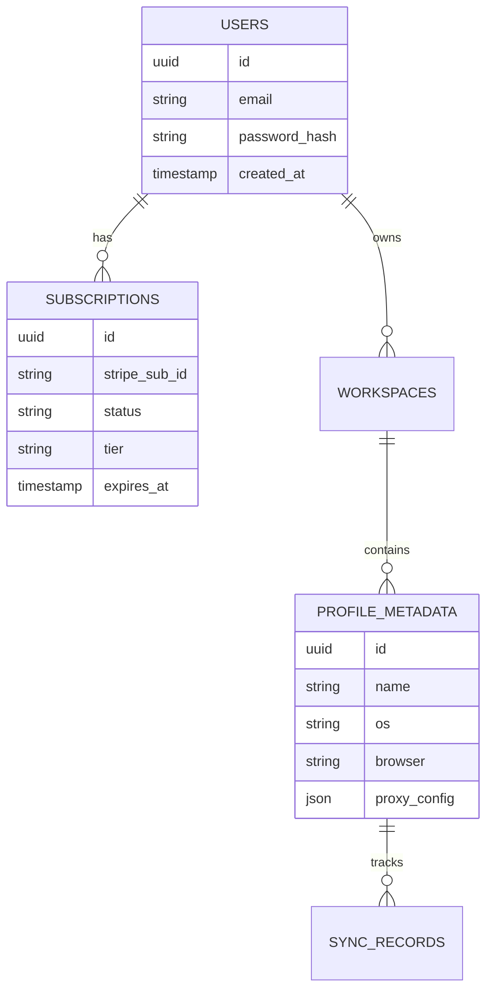

# Cloud Backend API Specification

This directory documents the Cloud Server architecture, database schema, payment gateways, and session sync endpoints.

---

## 1. Backend Service Index

The cloud backend is built using **NestJS** (TypeScript) or **Go** to act as a stateless API gateway:

```text
User Client (Desktop/Web)  ➔  NestJS API Gateway  ➔  Redis Cache (Locks & Sessions)
                                                  ➔  PostgreSQL (Relational Storage)
                                                  ➔  Cloudflare R2 (S3 Encrypted Cookies)
                                                  ➔  Stripe API (Billing Webhooks)
```

---

## 2. Key Modules & Functional Domains

### A. Authentication & User Management
*   Uses OAuth2 / JWT stateless authentication.
*   Endpoints:
    *   `POST /api/v1/auth/register` (Register user)
    *   `POST /api/v1/auth/login` (Returns access and refresh tokens)

### B. Profile Synchronization Module
*   Coordinates encrypted backups of profile cookies, localStorage, and configurations.
*   Interacts directly with Cloudflare R2 bucket via S3 SDK.
*   Endpoints:
    *   `POST /api/v1/profiles/:id/sync/check`
    *   `PUT /api/v1/profiles/:id/sync/upload`

### C. Licensing & Billing (Stripe)
*   Enforces tier gates (Starter, Pro, Enterprise) on client connection triggers.
*   Listens to Stripe webhooks (`checkout.session.completed`, `customer.subscription.updated`) to dynamically update database subscription columns.

---

## 3. Database Schema Mapping


