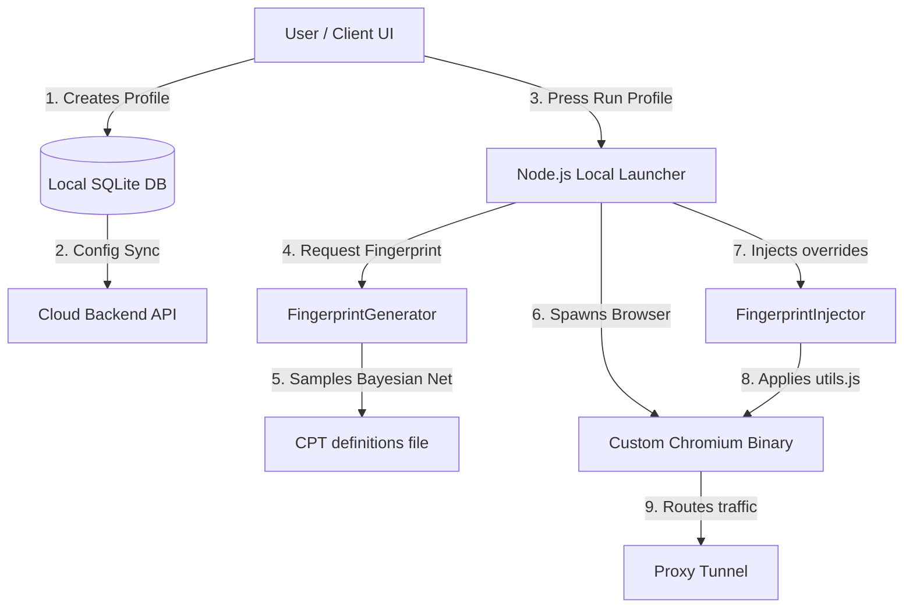

# Product Vision Specification

This document defines the high-level business vision, target audience, core problem resolution, and boundaries of the Anti-Detect Browser product.

---

## 1. Product Vision & Value Proposition

The product is a commercial-grade **Anti-Detect Browser** designed to allow operators to run multiple isolated, undetectable web sessions. Each browser session (profile) mimics a unique, physical computer, eliminating account linking and crawler detection.

---

## 2. Scope & Target Boundaries

### What We Resolve
*   **Browser Fingerprint Leakage**: Complete masking of WebDriver, canvas hash tracking, WebGL contexts, screen dimension matches, audio signals, and installed font families.
*   **Cookie & Cache Separation**: Secure, isolated caching directories (`--user-data-dir`) so data never crosses between browser profiles.
*   **Header and TCP/IP Matching**: Sorting request headers and shaping HTTP network calls to align with target browser families.
*   **IP Masking**: Custom SOCKS5/HTTP proxy tunnels programmatically assigned per profile.

### What We Do Not Resolve (Out of Scope)
*   **Bot-like Behavioral Detection**: We do not block sites from flagging automation if the user's script behaves unnaturally (e.g. clicking buttons at 1ms intervals, typing 1000 WPM).
*   **IP Reputation**: We do not guarantee proxy clean-ness. If the user uses blacklisted proxies, the site will still block the profile.

---

## 3. Core Target Audience

*   **Data Scrapers & Web Crawlers**: Accessing data from heavily protected sources (Cloudflare, Datadome, Kasada).
*   **Multi-Account Managers**: Controlling multiple advertising accounts (Google, Facebook, Amazon) without account linking.
*   **QA Automation Engineers**: Verifying layout and geo-location scaling of web apps under faked client systems.

---

## 4. End-to-End Business Flow

The flowchart below traces the business sequence from creating a profile to launching it:

