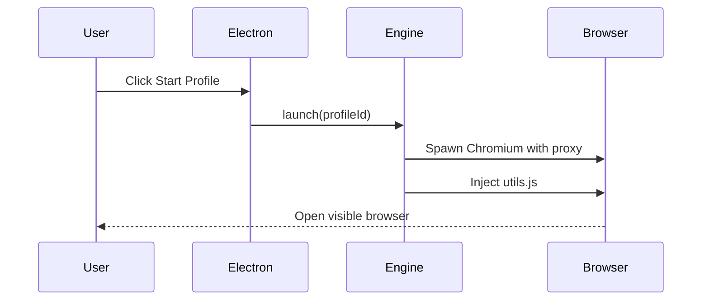

# RFC-0001: Product Vision

*   **Status**: Proposed
*   **Author**: Tech Lead
*   **Decided**: 2026-07-16

---

## 1. Background
Account creators, web scrapers, and ad managers operating at scale face aggressive anti-bot blocking (Cloudflare, Akamai) due to browser fingerprint matching.

## 2. Problem Statement
Default headless browsers leak automation flags. Redundant or inconsistent browser spoofing triggers bot flags. We need a commercial-grade anti-detect platform.

## 3. Goals
*   Generate high-coherency, fuzzed fingerprints.
*   Decouple front-end management from execution.
*   Enforce absolute profile isolation.

## 4. Non-Goals
*   Bypassing IP reputation limits.
*   Solving captcha grids or human verification challenges.

## 5. Functional Requirements
*   Create isolated SQLite browser profiles.
*   Inject runtime WebGL, Canvas, and Font evasions.
*   Configure proxy routing tunnels per profile.

## 6. Non-Functional Requirements
*   Page injection overhead < 2ms.
*   Zero metadata overlaps.

## 7. Architecture
We divide the workspace into an Electron front-end dashboard, a local Node/Playwright automation engine, and a cloud backend sync API.

## 8. Sequence Diagram

## 9. Data Model
Profile configuration structure mapping proxy variables and generated fingerprints.

## 10. API Contract
API handles local IPC triggers (`profile:launch`) and cloud sync requests (`/profile/:id/sync`).

## 11. State Machine
*   `STOPPED` ➔ `LAUNCHING` ➔ `RUNNING` ➔ `CLOSING` ➔ `STOPPED`

## 12. Configuration
*   Default JSON properties stored in sqlite.

## 13. Error Handling
If proxy ping fails, abort the launch to prevent leaking home IP.

## 14. Security Considerations
Local credentials and sync payloads must be encrypted using AES-GCM-256.

## 15. Performance
Generation of browser profiles takes < 5ms.

## 16. Testing Strategy
Nightly automation loops checking bypass rates against Turnstile.

## 17. Rollout Plan
*   Internal Alpha ➔ Private Beta ➔ Production release.

## 18. Open Questions
*   How to handle automatic Chrome version upgrades?

## 19. Future Improvements
*   Support Android/iOS mobile application simulation.

## 20. Appendix
Links to standard Web Fingerprinting resources.
