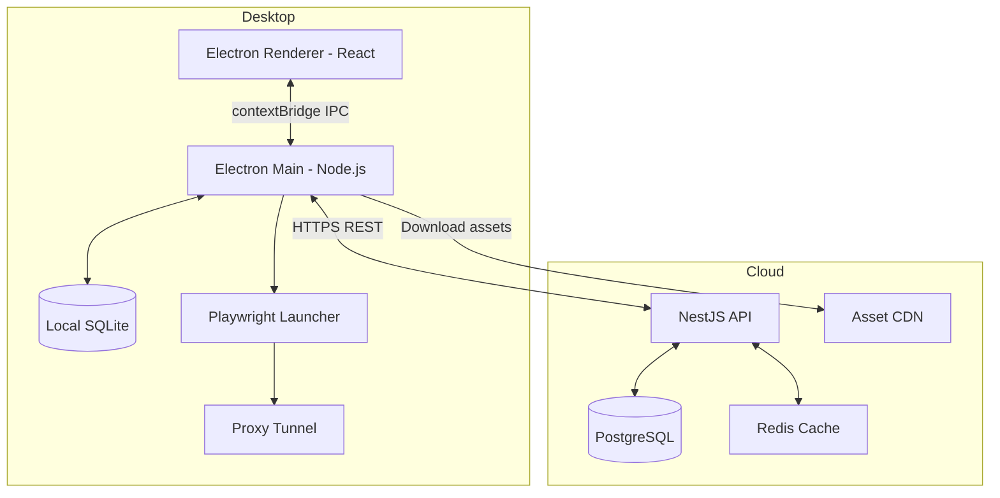
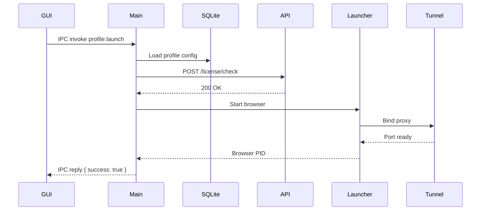

# RFC-0002: System Architecture

*   **Status**: Approved
*   **Author**: Architect
*   **Decided**: 2026-07-16

---

## 1. Background
We need a clear separation of concerns between Cloud, Desktop, and Browser layers to allow independent teams to operate without cross-dependency bottlenecks.

## 2. Problem Statement
A monolithic architecture would create tight coupling. If the Cloud API changes its data shape, the Desktop client and Browser engine would both break.

## 3. Goals
- Define clear component boundaries (Cloud, Desktop, Browser Engine, Proxy).
- Establish strict IPC contracts between Electron main/renderer processes.
- Define REST contract between Desktop client and Cloud API.

## 4. Non-Goals
- Implementation details of individual modules.
- UI/UX design decisions.

## 5. Functional Requirements
- Cloud API must be stateless and horizontally scalable.
- Desktop client must operate in **offline mode** with local SQLite cache.
- Browser engine must run isolated per profile via `--user-data-dir`.

## 6. Non-Functional Requirements
- API response time < 200ms (95th percentile).
- IPC latency < 5ms per round trip.
- Local launcher startup < 3 seconds.

## 7. Architecture


## 8. Sequence Diagram


## 9. Data Model
```
Profile {
  id: UUID
  name: string
  fingerprintConfig: JSON
  proxyConfig: JSON
  userDataDir: string
  status: STOPPED | RUNNING | ERROR
  lastSyncedAt: timestamp
}
```

## 10. API Contract
- `GET /api/v1/profiles` — List profiles
- `POST /api/v1/profiles` — Create profile
- `GET /api/v1/license/validate` — Check license validity
- `POST /api/v1/profiles/:id/sync` — Upload encrypted cookie blob

## 11. State Machine
```
Profile: STOPPED → LAUNCHING → RUNNING → CLOSING → STOPPED
                                        ↘ ERROR
```

## 12. Configuration
- `CLOUD_API_URL` in `.env`
- `LOCAL_DB_PATH` defaults to `%APPDATA%/anti-detect/profiles.db`

## 13. Error Handling
- Network failure: fallback to local cache, show offline badge.
- License invalid: block profile launch, redirect to billing page.
- Browser crash (exit ≠ 0): auto-save state, emit `profile:crashed` IPC event.

## 14. Security Considerations
- All Cloud API calls must use HTTPS with certificate pinning.
- Local SQLite database encrypted with SQLCipher (AES-256-GCM).
- IPC channels use `contextIsolation: true`, no `nodeIntegration`.

## 15. Performance
- Lazy-load fingerprint CPT models on first profile launch.
- Cache Cloud API responses in Redis with 5-minute TTL.

## 16. Testing Strategy
- Unit tests: IPC handler logic, SQLite CRUD.
- Integration tests: full profile launch-to-browser lifecycle.
- Load tests: 50 concurrent profiles on one machine.

## 17. Rollout Plan
Phase 1: Internal alpha with 5 test profiles.
Phase 2: Beta with 50 users.
Phase 3: Production release.

## 18. Open Questions
- Should we support Firefox in addition to Chromium?
- How do we handle profile migration between app versions?

## 19. Future Improvements
- Support mobile device fingerprint emulation.
- P2P profile sync between devices without Cloud dependency.

## 20. Appendix
- See [Architecture.md](../System/Architecture.md) for component diagrams.
