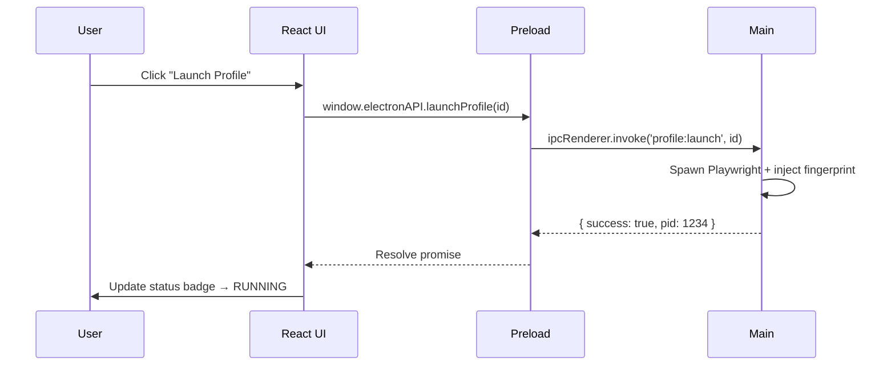

# RFC-0003: Desktop Application (Electron)

*   **Status**: Proposed
*   **Author**: Desktop Lead
*   **Decided**: 2026-07-16

---

## 1. Background
The desktop application is the primary interface users interact with. It must be performant, secure, and capable of running offline.

## 2. Problem Statement
Electron apps historically suffer from: large bundle sizes, insecure IPC setups (nodeIntegration leaks), and poor window management for multi-profile workflows.

## 3. Goals
- Secure IPC architecture using `contextBridge` and `contextIsolation`.
- Compact binary < 150MB using `electron-builder`.
- Support for 50+ concurrent profile management entries in the UI.

## 4. Non-Goals
- Building the browser engine (handled by Browser Team).
- Cloud API implementation (handled by Backend Team).

## 5. Functional Requirements
- Main window: Profile list with status indicators.
- Per-profile actions: Launch, Stop, Edit, Clone, Delete.
- Settings panel: Proxy configuration, fingerprint overrides.
- Auto-update support via `electron-updater`.

## 6. Non-Functional Requirements
- Startup time < 3 seconds on mid-range hardware.
- Memory usage < 200MB at idle (50 profiles loaded).
- UI renders at 60 FPS consistently.

## 7. Architecture
```text
apps/desktop-client/
├── src/
│ 
├── package.json
└── electron-builder.yml
```

## 8. Sequence Diagram


## 9. Data Model
```typescript
interface ProfileStatus {
  id: string;
  name: string;
  status: 'stopped' | 'launching' | 'running' | 'error';
  pid?: number;
  errorMessage?: string;
}
```

## 10. API Contract (IPC Channels)
| Channel | Direction | Payload | Response |
|---------|-----------|---------|----------|
| `profile:launch` | Renderer→Main | `{ profileId }` | `{ success, pid? }` |
| `profile:stop` | Renderer→Main | `{ profileId }` | `{ success }` |
| `profile:list` | Renderer→Main | — | `Profile[]` |
| `profile:crashed` | Main→Renderer | `{ profileId }` | — |
| `app:update-available` | Main→Renderer | `{ version }` | — |

## 11. State Machine
```
App: LOADING → READY → (per profile) → LAUNCHING → RUNNING → STOPPED
                                                            ↘ ERROR
```

## 12. Configuration
```javascript
// electron-builder.yml
appId: "com.antidetect.browser"
productName: "Midnight Browser"
win:
  target: nsis
  icon: assets/icon.ico
mac:
  target: dmg
  icon: assets/icon.icns
```

## 13. Error Handling
- IPC timeout (>10s): reject with `TIMEOUT_ERROR`, show retry dialog.
- Browser binary not found: redirect user to repair/reinstall flow.
- SQLite corruption: prompt user to reset local data.

## 14. Security Considerations
- `nodeIntegration: false` — renderer cannot access Node APIs directly.
- `contextIsolation: true` — preload script is sandboxed.
- `webSecurity: true` — no `file://` cross-origin bypass.
- No remote content loaded into main window (`allowRunningInsecureContent: false`).

## 15. Performance
- Profile list virtualized (react-window) for 500+ entries.
- IPC payloads serialized as JSON; avoid binary buffers in renderer.

## 16. Testing Strategy
- Unit: IPC handler functions with mocked Playwright calls.
- E2E: Spectron or Playwright for Electron tests.
- Manual: Launch, crash-recovery, and auto-update flows.

## 17. Rollout Plan
- Bundle via GitHub Actions CI/CD → sign → upload to CDN → `electron-updater` pulls delta.

## 18. Open Questions
- Use React or Vue for renderer? (Recommended: React + Zustand for state)
- Should the app tray icon show running profile count?

## 19. Future Improvements
- Dark/light theme toggle.
- Browser window screenshot thumbnail in profile cards.

## 20. Appendix
- See [Electron.md](../System/Electron.md) for IPC bridge code examples.
