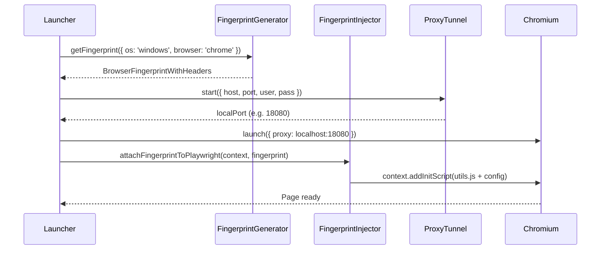

# RFC-0004: Browser Engine & Chromium Integration

*   **Status**: Proposed
*   **Author**: Browser Lead
*   **Decided**: 2026-07-16

---

## 1. Background
The core value of the product is an undetectable browser session. The browser engine layer defines how we launch, configure, and inject stealth into Chromium.

## 2. Problem Statement
Stock Playwright/Puppeteer launches are trivially detectable. `navigator.webdriver === true`, CDP metadata leaks, and missing navigator properties immediately flag automation.

## 3. Goals
- Launch headful Chromium with `--disable-blink-features=AutomationControlled`.
- Inject fingerprint overrides via `addInitScript` before any page JS runs.
- Prevent CDP metadata leaks.

## 4. Non-Goals
- Building a custom Chromium fork (planned for Milestone 4).
- Handling mobile/iOS fingerprinting.

## 5. Functional Requirements
- Support Playwright and Puppeteer integrations.
- Apply fingerprints atomically before first navigation.
- Route all traffic through profile's assigned proxy tunnel.
- Maintain separate `--user-data-dir` per profile.

## 6. Non-Functional Requirements
- Injection must complete before `DOMContentLoaded` fires.
- Zero CDP metadata leaks in standard mode.
- Headful launch < 3 seconds on standard hardware.

## 7. Architecture
```text
Launcher (main.js)
   ├── FingerprintGenerator → generates coherent fingerprint config
   ├── FingerprintInjector → serializes utils.js + config into addInitScript
   ├── ProxyTunnel → starts local authenticated proxy
   └── Playwright.chromium.launch()
          ├── args: --user-data-dir, --proxy-server=localhost:PORT
          ├── args: --disable-blink-features=AutomationControlled
          └── context.addInitScript(injectedScript)
```

## 8. Sequence Diagram


## 9. Data Model
```typescript
interface BrowserLaunchConfig {
  profileId: string;
  userDataDir: string;
  proxy?: { host: string; port: number; username: string; password: string };
  fingerprint: BrowserFingerprintWithHeaders;
  headless: boolean;
}
```

## 10. API Contract
```typescript
// Launcher public API
async function launchProfile(config: BrowserLaunchConfig): Promise<{ pid: number }>;
async function stopProfile(profileId: string): Promise<void>;
```

## 11. State Machine
```
Profile Browser: IDLE → LAUNCHING → INJECTING → NAVIGATING → ACTIVE → CLOSING → IDLE
                                                                       ↘ CRASHED
```

## 12. Configuration
```javascript
// Chromium launch flags (security-critical)
const STEALTH_ARGS = [
  '--disable-blink-features=AutomationControlled',
  '--disable-infobars',
  '--no-first-run',
  '--no-default-browser-check',
  '--use-fake-ui-for-media-stream',
  '--disable-notifications',
];
```

## 13. Error Handling
- Binary not found: throw `BROWSER_BINARY_NOT_FOUND` with installation guide link.
- Proxy unreachable: abort launch, never expose real IP.
- Injection failed: retry once, log error to profile audit trail.

## 14. Security Considerations
- Never launch with real IP if proxy is configured but fails.
- Validate `--user-data-dir` path to prevent path traversal.
- Sanitize all IPC inputs before passing to launcher args.

## 15. Performance
- Reuse browser contexts where possible (session continuation).
- Pre-generate fingerprints on profile creation (not on launch).

## 16. Testing Strategy
- Verify `navigator.webdriver === false` on launch.
- Verify WebGL renderer matches fingerprint config.
- Verify proxy routing via external IP check.

## 17. Rollout Plan
- Phase 1: Playwright chromium (stock binary).
- Phase 2: Patched Chromium binary with C++ flag patches for deeper evasion.

## 18. Open Questions
- Should we support Firefox via Playwright Firefox engine?
- How to handle Chromium auto-updates breaking stealth patches?

## 19. Future Improvements
- Custom Chromium fork with hardened canvas noise at the C++ level.
- Support Android device emulation modes.

## 20. Appendix
- See [Playwright.md](../System/Playwright.md) for integration patterns.
- See [RFC-0007](RFC-0007-Fingerprint-Engine.md) for fingerprint generation details.
