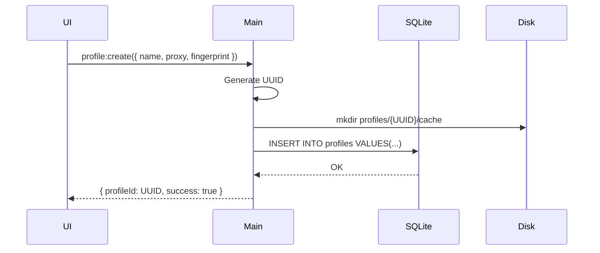

# RFC-0005: Browser Profile Management

*   **Status**: Proposed
*   **Author**: Desktop Lead
*   **Decided**: 2026-07-16

---

## 1. Background
Each browser session must be completely isolated — cookies, localStorage, IndexedDB, cache, extensions, and fingerprint configurations must never bleed between profiles.

## 2. Problem Statement
Without profile isolation, websites correlate sessions by shared storage artifacts. Even with different IPs and fingerprints, a shared `--user-data-dir` instantly links accounts.

## 3. Goals
- Full disk-level isolation per profile via dedicated `--user-data-dir`.
- Profile metadata stored in local SQLite database.
- CRUD operations for profiles via IPC API.

## 4. Non-Goals
- Cloud sync of profile data (see RFC-0014).
- Cookie import/export UI (deferred to later milestone).

## 5. Functional Requirements
- Create profile: generates UUID, creates folder, stores config.
- Launch profile: reads config from SQLite, spawns Chromium.
- Clone profile: duplicates config without copying cache data.
- Delete profile: removes SQLite row and wipes `--user-data-dir` folder.
- Import/Export: JSON export of profile config (no session data).

## 6. Non-Functional Requirements
- Profile creation < 100ms (disk I/O + SQLite write).
- Support 500+ profiles in the list without UI lag.
- Profile folder max size warning at 2GB.

## 7. Architecture
```text
profiles/
└── {profileId}/
    ├── cache/                 ← Chromium --user-data-dir
    │   └── Default/
    │       ├── Cookies        ← SQLite (Chromium-managed)
    │       ├── Local Storage/
    │       └── Network/
    ├── extensions/            ← Profile-specific extensions
    └── profile.json          ← Snapshot of current config
```

## 8. Sequence Diagram


## 9. Data Model
```sql
CREATE TABLE profiles (
  id          TEXT PRIMARY KEY,
  name        TEXT NOT NULL,
  os          TEXT NOT NULL DEFAULT 'windows',
  browser     TEXT NOT NULL DEFAULT 'chrome',
  proxy_host  TEXT,
  proxy_port  INTEGER,
  proxy_user  TEXT,
  proxy_pass  TEXT,             -- encrypted with profile master key
  fingerprint TEXT,             -- JSON blob
  status      TEXT DEFAULT 'stopped',
  user_data_dir TEXT NOT NULL,
  created_at  INTEGER NOT NULL,
  updated_at  INTEGER NOT NULL
);
```

## 10. API Contract
| IPC Channel | Payload | Response |
|---|---|---|
| `profile:create` | `ProfileCreateDTO` | `Profile` |
| `profile:update` | `{ id, ...partial }` | `Profile` |
| `profile:delete` | `{ id }` | `{ success }` |
| `profile:clone` | `{ id }` | `Profile` |
| `profile:export` | `{ id }` | `ProfileExportJSON` |

## 11. State Machine
```
Profile: STOPPED → LAUNCHING → RUNNING → CLOSING → STOPPED
                                        ↘ CRASHED
```

## 12. Configuration
- Default `userDataDir` root: `%APPDATA%\MidnightBrowser\profiles\` (Windows)
- Max profiles per workspace: 1000

## 13. Error Handling
- Duplicate profile name: return `DUPLICATE_NAME` error.
- Disk full on create: return `INSUFFICIENT_DISK_SPACE` error.
- Profile folder missing on launch: auto-recreate and warn user.

## 14. Security Considerations
- Proxy passwords stored encrypted with AES-256-GCM using derived key from user master password.
- Profile IDs are UUIDs v4 (random), not sequential.
- Delete operation uses secure wipe (overwrite before delete) for sensitive profile data.

## 15. Performance
- Profile list query uses SQLite index on `status` column.
- Batch status updates via SQLite transactions (not one-by-one).

## 16. Testing Strategy
- Unit: SQLite CRUD operations, folder creation/deletion.
- Integration: Full create→launch→stop→delete lifecycle.
- Edge cases: Delete running profile, clone with proxy, disk full simulation.

## 17. Rollout Plan
- Ship with Milestone 3 (Database & Cloud Sync).

## 18. Open Questions
- Should we support profile groups/folders for organization?
- Max concurrent running profiles per license tier?

## 19. Future Improvements
- Profile templates (pre-configured fingerprint presets).
- Bulk import from CSV/JSON.

## 20. Appendix
- See [RFC-0015](RFC-0015-SQLite-Database.md) for full database schema.
