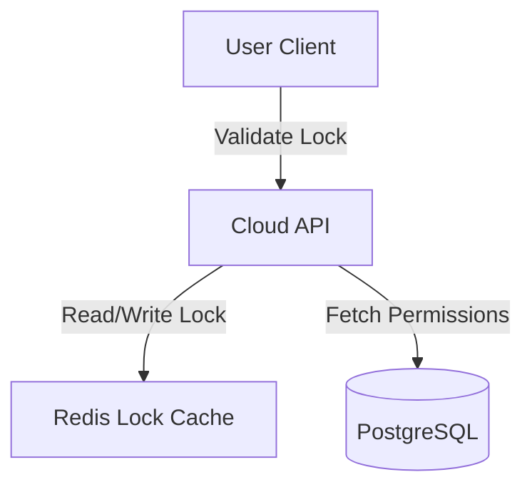
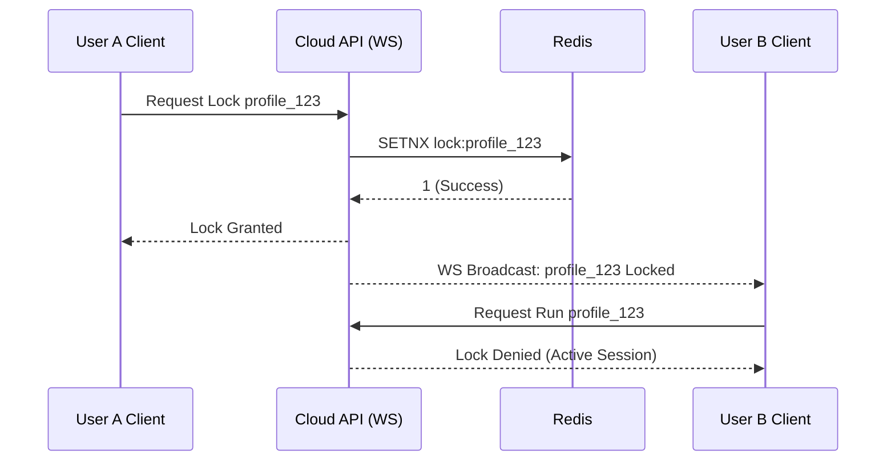

# RFC-0006: Workspace & Team Management

*   **Status**: Proposed
*   **Author**: Backend Lead
*   **Decided**: 2026-07-16

---

## 1. Background
Enterprise customers require profile sharing capabilities. Multi-user organizations must collaborate on the same browser profiles (e.g., social media agencies sharing advertising accounts).

## 2. Problem Statement
Sharing raw profiles causes session conflicts if two users open the same profile simultaneously. We need a workspace permissions model with real-time lock tracking.

## 3. Goals
- Support multi-tenant Workspaces.
- Define roles: Owner, Admin, Manager, Operator.
- Real-time profile state lock (prevent concurrent runs).

## 4. Non-Goals
- P2P direct profile transfers (always transit via Cloud DB).

## 5. Functional Requirements
- Users can create Workspaces.
- Workspace Owners can invite team members and assign roles.
- Shared profiles must sync lock-state via WebSockets.

## 6. Non-Functional Requirements
- Lock propagation latency < 500ms.
- Permissions verification overhead < 10ms.

## 7. Architecture


## 8. Sequence Diagram


## 9. Data Model
```sql
CREATE TABLE workspaces (
  id TEXT PRIMARY KEY,
  name TEXT NOT NULL,
  owner_id TEXT NOT NULL,
  created_at TIMESTAMP
);

CREATE TABLE workspace_members (
  workspace_id TEXT REFERENCES workspaces(id),
  user_id TEXT NOT NULL,
  role TEXT NOT NULL,          -- ADMIN, MANAGER, OPERATOR
  PRIMARY KEY (workspace_id, user_id)
);
```

## 10. API Contract
- `POST /api/v1/workspaces/:id/members` — Invite user.
- `GET /api/v1/workspaces/:id/profiles` — Fetch shared profiles.

## 11. State Machine
*   `FREE` ➔ `LOCKED` ➔ `FREE`

## 12. Configuration
*   `LOCK_TIMEOUT_SEC`: 10800 (3 hours max lock duration if heartbeat dies).

## 13. Error Handling
- Locked profile: return `PROFILE_LOCKED` error.
- Invite duplicate: return `ALREADY_MEMBER` status.

## 14. Security Considerations
- JWT containing active `workspace_id` validation on all actions.
- Action logs stored in database for compliance.

## 15. Performance
- Locks are managed in Redis with TTL to prevent DB bottleneck.

## 16. Testing Strategy
- Integration: concurrent lock requests check.
- Unit: workspace role permissions audits.

## 17. Rollout Plan
- Deploy with Milestone 3 (Cloud Sync).

## 18. Open Questions
- Can a profile exist in multiple workspaces? (No, 1-to-1).

## 19. Future Improvements
- Slack integration for audit notifications.

## 20. Appendix
- Workspace schema diagrams in DB spec.
