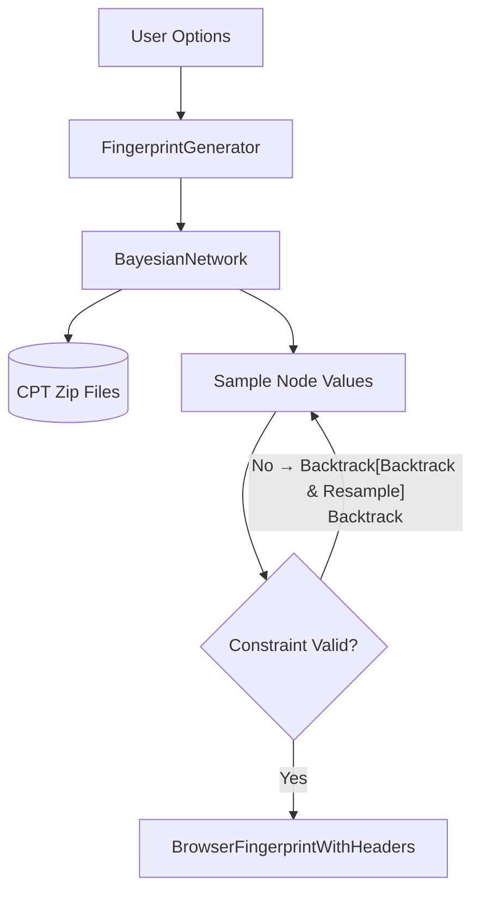
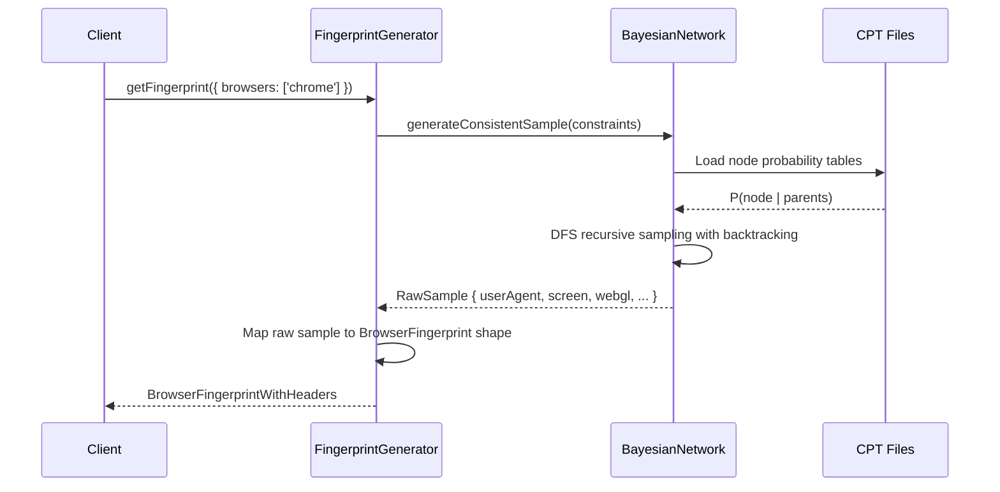

# RFC-0007: Fingerprint Generation Engine

*   **Status**: Approved
*   **Author**: Browser Lead
*   **Decided**: 2026-07-16

---

## 1. Background
The `fingerprint-generator` package uses a Bayesian Network to sample coherent device fingerprints. Understanding its architecture is critical for all teams that consume fingerprint data.

## 2. Problem Statement
Naive random fingerprint generation produces incoherent combinations (e.g., an iPhone running Chrome on Windows with a Linux GPU). These incoherencies are trivially detectable.

## 3. Goals
- Generate statistically coherent fingerprints using the Bayesian CPT network.
- Support user constraints (e.g., `operatingSystems: ['windows']`).
- Propagate constraints through the network to maintain joint probability validity.

## 4. Non-Goals
- Real-time fingerprint learning from live traffic.
- Supporting non-browser fingerprints (mobile apps, scripts).

## 5. Functional Requirements
- `getFingerprint(options?)` generates a complete `BrowserFingerprintWithHeaders` object.
- Supports filtering by `browsers`, `operatingSystems`, `devices`, `locales`, `httpVersion`.
- Constraint relaxation: if exact constraints produce no valid samples, loosen restrictions progressively.

## 6. Non-Functional Requirements
- Generation time: < 5ms without constraints, < 50ms with strict constraints.
- No two sequential calls should return identical fingerprints.

## 7. Architecture


## 8. Sequence Diagram


## 9. Data Model
```typescript
interface BrowserFingerprintWithHeaders {
  fingerprint: {
    navigator: NavigatorOverrides;
    screen: ScreenOverrides;
    webGl: WebGLOverrides;
    audioCodecs: Record<string, string>;
    videoCodecs: Record<string, string>;
    battery: BatteryOverrides;
    multimediaDevices: DeviceList;
  };
  headers: Record<string, string>;
}
```

## 10. API Contract
```typescript
class FingerprintGenerator {
  constructor(options?: FingerprintGeneratorOptions);
  getFingerprint(options?: FingerprintGeneratorOptions): BrowserFingerprintWithHeaders;
}
```

## 11. State Machine
Stateless — each `getFingerprint()` call is independent.

## 12. Configuration
```typescript
interface FingerprintGeneratorOptions {
  browsers?: SupportedBrowser[];
  operatingSystems?: SupportedOS[];
  devices?: ('desktop' | 'mobile')[];
  locales?: string[];
  httpVersion?: 1 | 2;
  screen?: { minWidth?: number; maxWidth?: number; minHeight?: number; maxHeight?: number };
}
```

## 13. Error Handling
- Over-constrained options: automatic constraint relaxation in priority order (screen → locale → OS → browser).
- CPT file missing: throw `MODEL_NOT_FOUND` with package name.
- Infinite backtrack loop: throw `CONSTRAINT_UNSATISFIABLE` after 100 iterations.

## 14. Security Considerations
- CPT model files are read-only; no user-supplied model injection allowed.
- Output fingerprints must not expose host system properties.

## 15. Performance
- CPT models loaded once at constructor time, cached in memory.
- Target: P95 generation < 50ms even with strict constraints.

## 16. Testing Strategy
```bash
pnpm --filter fingerprint-generator test
```
- Assert generated OS matches constraint.
- Assert no two identical fingerprints in 1000 calls.
- Assert coherence: macOS UA never paired with Windows fonts.

## 17. Rollout Plan
- Published as `fingerprint-generator` npm package.
- Consumed internally by `desktop-client` and `test_evasion.js`.

## 18. Open Questions
- Should the model be updateable via CDN without re-installing the package?

## 19. Future Improvements
- Online learning: refine CPT tables from real browser telemetry.
- Generative model replacement (VAE-based).

## 20. Appendix
- See [Database.md](../System/Database.md) for CPT file format.
- See `packages/fingerprint-generator/src/` for source.
