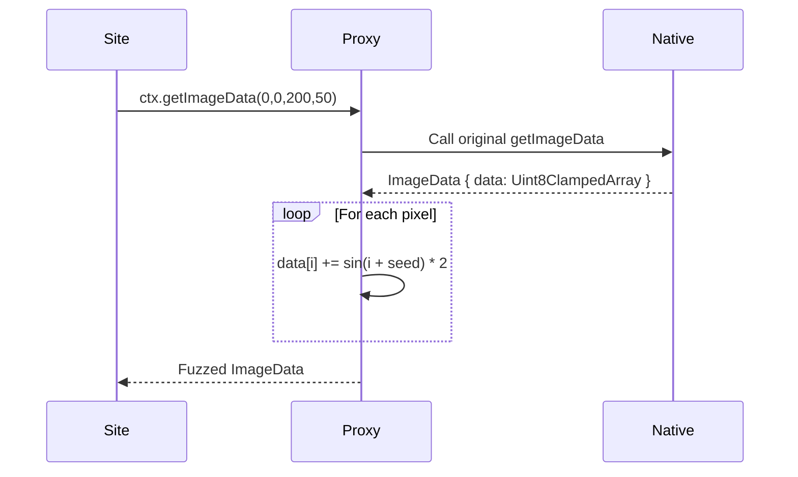

# RFC-0008: Canvas Fingerprinting Evasion

*   **Status**: Proposed
*   **Author**: Browser Lead
*   **Decided**: 2026-07-16

---

## 1. Background
Canvas fingerprinting works by rendering a hidden image using `<canvas>` and extracting its pixel data via `toDataURL()` or `getImageData()`. The resulting hash is unique to each hardware/OS/GPU/driver combination.

## 2. Problem Statement
All headless Chromium instances on the same server produce identical canvas hashes, making them trivially linkable.

## 3. Goals
- Inject per-profile deterministic pixel noise into `getImageData()` output.
- Ensure the same profile always produces the same canvas hash (consistency).
- Ensure different profiles always produce different canvas hashes (isolation).

## 4. Non-Goals
- Spoofing exact pixel output of a specific target machine.
- Modifying SVG-based fingerprinting (separate RFC).

## 5. Functional Requirements
- Override `CanvasRenderingContext2D.prototype.getImageData`.
- Apply per-pixel noise derived from `canvasSeed`.
- Override `HTMLCanvasElement.prototype.toDataURL` to route through fuzzed getImageData.

## 6. Non-Functional Requirements
- Noise magnitude: max ±2 RGB values per pixel (invisible to human eye).
- Fuzz computation overhead: < 1ms for standard 200x50 canvas.
- Must not break site layout (invisible canvas must still render correctly).

## 7. Architecture
```text
Hook: getImageData → apply RGB noise → return fuzzed ImageData
Hook: toDataURL → internally calls getImageData path → returns fuzzed PNG
```

## 8. Sequence Diagram


## 9. Data Model
- `canvasSeed: number` — integer stored in profile config, used as noise seed.

## 10. API Contract
Extends native `CanvasRenderingContext2D` prototype. No new public API.

## 11. State Machine
Stateless override applied once at `addInitScript` time.

## 12. Configuration
- `slim: true` — disables canvas noise for performance-critical sessions.
- `canvasSeed: number` — per-profile seed value.

## 13. Error Handling
- If `getImageData` throws (e.g., cross-origin canvas): pass through original error unchanged.
- If canvas is 0×0 dimensions: return original unmodified data.

## 14. Security Considerations
- Noise must be deterministic (same seed = same output) to avoid detection via consistency checks.
- Must not alter pixel data outside visible bounds.

## 15. Performance
- For large canvases (4K): consider skipping noise or sampling every Nth pixel.
- Benchmark: 200×50 canvas fuzz < 0.5ms.

## 16. Testing Strategy
- Assert: two profiles with different seeds produce different `toDataURL()` outputs.
- Assert: same profile (same seed) produces identical output across reloads.
- Assert: `getImageData.toString()` returns native code string.

## 17. Rollout Plan
- Included in default `fingerprint-injector` injection script.
- Disabled in `slim` mode for headless scraping use cases.

## 18. Open Questions
- Should we add noise to `toBlob()` as well?
- How to handle WebGL-rendered canvas (separate pipeline)?

## 19. Future Improvements
- Hardware-level canvas noise injection via Chromium C++ patch.

## 20. Appendix
- See [RFC-0009](RFC-0009-Font-Fingerprinting.md) for related measureText fuzzing.
- See `packages/fingerprint-injector/src/` for injection source.
