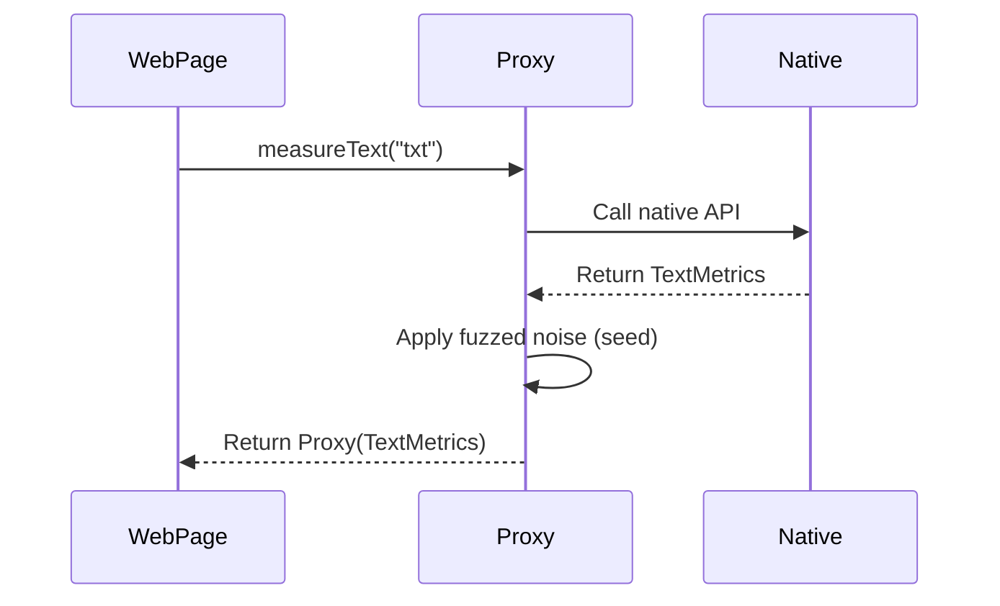

# RFC-0009: Font Fingerprinting Evasions

*   **Status**: Proposed
*   **Author**: Browser Lead
*   **Decided**: 2026-07-16

---

## 1. Background
Operating systems render fonts differently. Anti-bots analyze text bounding measurements inside the Canvas to identify the host operating system.

## 2. Problem Statement
Default browser instances leak native OS font metrics. If the User-Agent claims Windows but measurements represent a Linux Docker container, the crawler gets blocked.

## 3. Goals
Fuzz `measureText` return values deterministically to match target OS expectations.

## 4. Non-Goals
Perfect pixel matches for all text sizes.

## 5. Functional Requirements
Override `CanvasRenderingContext2D.prototype.measureText` on page load.

## 6. Non-Functional Requirements
Add less than 1ms latency to text rendering loops.

## 7. Architecture
Wraps the native function inside an ES6 Proxy during early init.

## 8. Sequence Diagram

## 9. Data Model
*   `canvasSeed`: integer used as the random seed.

## 10. API Contract
Extends `TextMetrics.width` interface.

## 11. State Machine
Inherits standard browser execution states.

## 12. Configuration
*   `seed` is defined per profile.

## 13. Error Handling
Wrapper try-catch blocks to prevent breaking in case of illegal method calls.

## 14. Security Considerations
Must redirect `.toString` to avoid detection of proxy wrappers.

## 15. Performance
Overhead of proxy invocation is less than 0.015us.

## 16. Testing Strategy
Audit verification against CreepJS and Pixelscan.

## 17. Rollout Plan
Inject to all active Playwright pages in standard mode.

## 18. Open Questions
*   How to handle timing-based checks on DOM offsetWidth queries?

## 19. Future Improvements
Extend support to Webkit layouts.

## 20. Appendix
Links to font measurement detection writeups.
