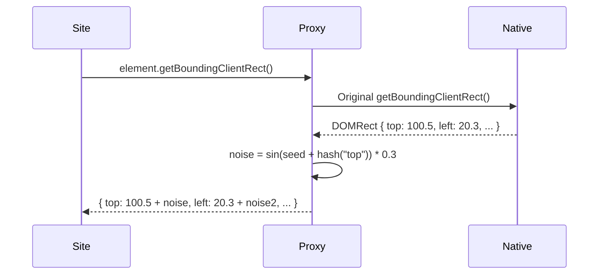

# RFC-0010: ClientRects Fingerprinting Evasion

*   **Status**: Proposed
*   **Author**: Browser Lead
*   **Decided**: 2026-07-16

---

## 1. Background
`getBoundingClientRect()` and `getClientRects()` return sub-pixel floating-point bounding boxes for DOM elements. Each OS/GPU/driver combination renders these at slightly different sub-pixel offsets.

## 2. Problem Statement
Anti-bots create hidden elements, call `getBoundingClientRect()`, and compare the sub-pixel decimal values against known system profiles. Headless Docker containers return Linux-specific values that contradict the claimed Windows User-Agent.

## 3. Goals
- Inject deterministic sub-pixel jitter into `getBoundingClientRect()` and `getClientRects()`.
- Jitter must be consistent within the same profile (same seed → same offset).
- Jitter magnitude must be imperceptible (< 0.5px in any direction).

## 4. Non-Goals
- Modifying layout/rendering behavior visible to the user.
- Spoofing CSS pixel ratio (separate override).

## 5. Functional Requirements
- Override `Element.prototype.getBoundingClientRect`.
- Override `Element.prototype.getClientRects`.
- Apply deterministic noise to `top`, `left`, `bottom`, `right`, `x`, `y` properties.

## 6. Non-Functional Requirements
- Jitter range: ±0.1 to ±0.5 pixels.
- Must not break site layout (jitter too large causes layout shifts).
- Overhead: < 0.01ms per call.

## 7. Architecture
```text
Hook: getBoundingClientRect()
  → call original
  → create DOMRect-like Proxy
  → intercept { top, left, bottom, right, x, y, width, height }
  → return (original + deterministic_noise(seed, property_name))
```

## 8. Sequence Diagram


## 9. Data Model
- `rectSeed: number` — per-profile seed, may share `canvasSeed` or be independent.

## 10. API Contract
Extends native `Element.prototype`. No new public API surface.

## 11. State Machine
Stateless override applied once at init.

## 12. Configuration
- `rectNoiseMagnitude: number` — default `0.3`, range `0.1–0.5`.

## 13. Error Handling
- If element not attached to DOM: pass through original result.
- If result properties are accessed via destructuring: Proxy must handle `Symbol.iterator`.

## 14. Security Considerations
- Must override on all iframes to prevent detection via sandboxed frames.
- Must apply same seed across frames to ensure consistency.

## 15. Performance
- For sites that call `getBoundingClientRect()` in tight loops (e.g., virtualized lists): consider caching jitter per element reference.

## 16. Testing Strategy
- Assert: `div.getBoundingClientRect().top` !== native value.
- Assert: same element, same session = same jitter value.
- Assert: different profiles = different jitter values.
- Assert: `getBoundingClientRect.toString()` returns native code string.

## 17. Rollout Plan
- Included in `fingerprint-injector` default injection.

## 18. Open Questions
- Should we apply jitter to `IntersectionObserver` entries as well?

## 19. Future Improvements
- Apply to `ResizeObserver` entries for completeness.

## 20. Appendix
- See [RFC-0009](RFC-0009-Font-Fingerprinting.md) for related font measurement evasion.
