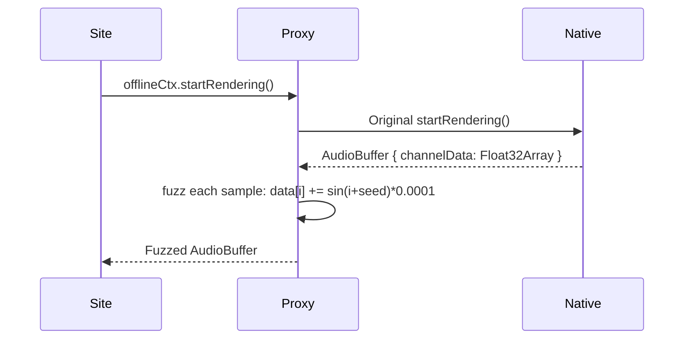

# RFC-0011: Audio Fingerprinting Evasion

*   **Status**: Proposed
*   **Author**: Browser Lead
*   **Decided**: 2026-07-16

---

## 1. Background
The Web Audio API is used to generate a unique fingerprint by processing audio signals through an `AudioContext`. The resulting floating-point values from `AnalyserNode` or `OfflineAudioContext` are unique to the host CPU's floating-point unit behavior.

## 2. Problem Statement
The `OfflineAudioContext` renders a short audio graph and extracts the output. The tiny numerical differences in floating-point arithmetic expose the actual hardware CPU model, which can contradict the spoofed User-Agent.

## 3. Goals
- Intercept `OfflineAudioContext.prototype.startRendering` to inject deterministic noise into the resulting audio buffer.
- Inject noise via `AudioBuffer.prototype.getChannelData`.

## 4. Non-Goals
- Muting audio in active browser sessions.
- Modifying `MediaStream` audio tracks.

## 5. Functional Requirements
- Override `OfflineAudioContext.prototype.startRendering`.
- After rendering completes, modify output `AudioBuffer` channel data.
- Apply deterministic noise using `audioSeed`.

## 6. Non-Functional Requirements
- Noise magnitude: ±0.0001 (imperceptible, below audible threshold).
- Must not prevent `startRendering` from completing normally.

## 7. Architecture
```text
Hook: OfflineAudioContext.startRendering()
  → call original (Promise)
  → on resolve: intercept AudioBuffer
  → fuzz getChannelData() float values with sin(index + audioSeed) * 0.0001
```

## 8. Sequence Diagram


## 9. Data Model
- `audioSeed: number` — per-profile seed.

## 10. API Contract
Extends native `OfflineAudioContext.prototype`. No new public API.

## 11. State Machine
Stateless hook applied at init.

## 12. Configuration
- `audioNoiseMagnitude: number` — default `0.0001`.

## 13. Error Handling
- If `startRendering()` throws: pass through original error.
- If channel count is 0: skip fuzzing.

## 14. Security Considerations
- Same profile seed must produce identical audio hash across sessions.
- Never expose real hardware floating-point signature.

## 15. Performance
- Fuzzing a 1-second mono buffer at 44100Hz takes < 0.5ms.

## 16. Testing Strategy
- Assert: two profiles produce different `getChannelData()` outputs.
- Assert: same profile produces identical output across page reloads.

## 17. Rollout Plan
- Included in `fingerprint-injector` default injection bundle.

## 18. Open Questions
- Should we also fuzz `AudioContext.prototype.sampleRate`?

## 19. Future Improvements
- Apply to `ScriptProcessorNode` as well for completeness.

## 20. Appendix
- See [RFC-0008](RFC-0008-Canvas-Fingerprinting.md) for related canvas noise methodology.
