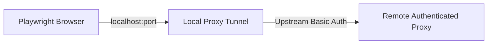
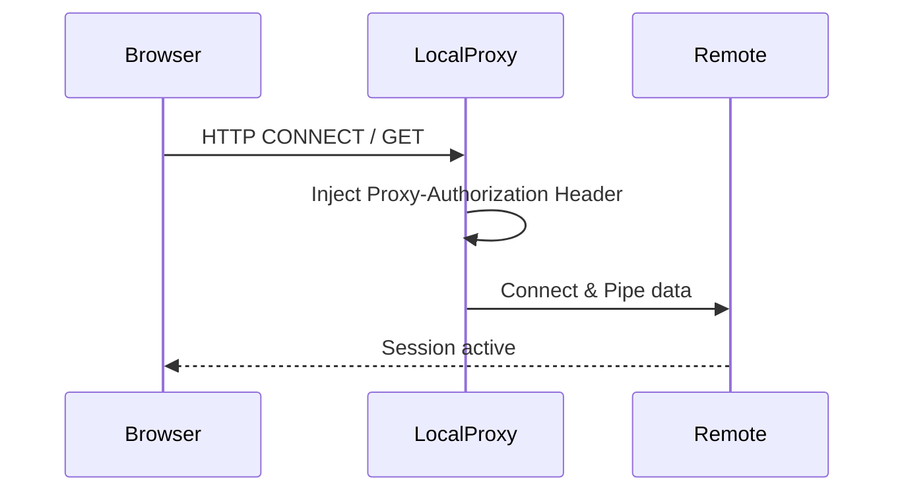

# RFC-0012: Local Proxy Authentication Tunnel

*   **Status**: Proposed
*   **Author**: Backend Lead
*   **Decided**: 2026-07-16

---

## 1. Background
Playwright and Puppeteer do not support starting a browser with authenticated proxies without triggering blocking OS basic authentication credentials dialogs.

## 2. Problem Statement
We need to connect to SOCKS5/HTTP proxies that require username/password authentication dynamically, without showing credentials dialogs.

## 3. Goals
Tunnel proxy connections through a local authenticated handler.

## 4. Non-Goals
Writing a custom proxy protocol wrapper.

## 5. Functional Requirements
*   Start a local HTTP server listening on a dynamic port.
*   Forward requests and inject basic auth headers to the upstream proxy.

## 6. Non-Functional Requirements
Tunnel overhead latency must be less than 5ms.

## 7. Architecture

## 8. Sequence Diagram

## 9. Data Model
*   `UpstreamProxy`: `{ host, port, username, password }`

## 10. API Contract
Starts on local port assignment.

## 11. State Machine
*   `STOPPED` ➔ `RUNNING` ➔ `STOPPED`

## 12. Configuration
*   Proxy configs stored inside profile settings database.

## 13. Error Handling
On tunnel crash, kill the browser instance to prevent IP leaks.

## 14. Security Considerations
Store proxy passwords locally encrypted using AES-GCM-256.

## 15. Performance
Handles up to 100 concurrent requests without network bottlenecks.

## 16. Testing Strategy
Verify proxy integration against remote IP geo-location checkers.

## 17. Rollout Plan
Bundle inside the Electron app packages structure.

## 18. Open Questions
*   How to handle high latency SOCKS5 proxies without timeouts?

## 19. Future Improvements
Support automated proxy rotations.

## 20. Appendix
Links to HTTP Tunneling protocols specs.
