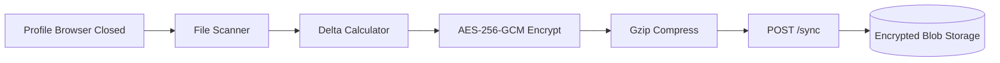
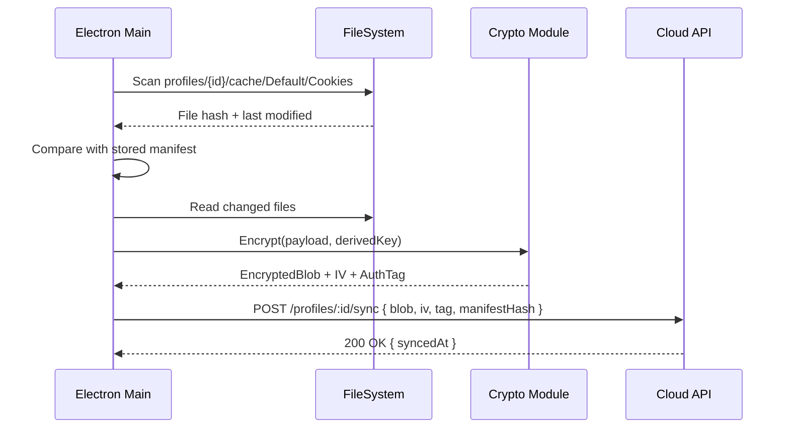

# RFC-0013: Cookie & Session Synchronization

*   **Status**: Proposed
*   **Author**: Backend Lead
*   **Decided**: 2026-07-16

---

## 1. Background
Users need to access their browser profiles (including active login sessions) across multiple machines. This requires syncing cookies, localStorage, and session data to Cloud.

## 2. Problem Statement
Syncing raw session data to Cloud is a major security and privacy risk. The Cloud server must never see plaintext credentials or session tokens.

## 3. Goals
- Zero-knowledge client-side encryption before upload.
- Incremental sync (delta uploads, not full uploads).
- Restore sessions on a new device without data loss.

## 4. Non-Goals
- Real-time live sync (this is a point-in-time snapshot sync).
- Syncing browser extension state.

## 5. Functional Requirements
- On profile close: scan `--user-data-dir` for changed cookie/storage files.
- Encrypt diff payload with profile-specific AES-256-GCM key.
- Upload encrypted blob to `POST /api/v1/profiles/:id/sync`.
- On new device restore: download blob, decrypt locally, restore files.

## 6. Non-Functional Requirements
- Encryption must complete client-side before any network activity.
- Sync blob size: compressed < 5MB for typical sessions.
- Restore time: < 10 seconds for full session restore.

## 7. Architecture


## 8. Sequence Diagram


## 9. Data Model
```typescript
interface SyncPayload {
  profileId: string;
  manifestHash: string;    // SHA-256 of file manifest
  encryptedBlob: string;   // Base64 AES-256-GCM ciphertext
  iv: string;              // Base64 initialization vector
  authTag: string;         // Base64 GCM auth tag
  compressedSize: number;
  syncedAt: number;        // Unix timestamp
}
```

## 10. API Contract
```
POST /api/v1/profiles/:id/sync
Authorization: Bearer {token}
Body: SyncPayload
Response: { syncedAt: timestamp }

GET /api/v1/profiles/:id/sync/latest
Response: SyncPayload (or 404 if no sync exists)
```

## 11. State Machine
```
Sync: IDLE → SCANNING → ENCRYPTING → UPLOADING → DONE
                                               ↘ ERROR
```

## 12. Configuration
- `syncOnClose: boolean` — auto-sync when browser window closes.
- `syncIntervalMs: number` — periodic sync interval (default: 300000ms = 5min).

## 13. Error Handling
- Network failure: queue sync job, retry with exponential backoff.
- Encryption failure: abort sync, log error, never upload plaintext.
- File locked (browser still running): skip file, sync on next close.

## 14. Security Considerations
- Key derivation: PBKDF2-HMAC-SHA256, 100,000 iterations, per-profile random salt.
- Key never leaves the client device.
- Cloud server stores only ciphertext blobs — zero-knowledge architecture.

## 15. Performance
- Delta sync: only upload changed files (tracked by inode modification time).
- Gzip compression reduces typical session payload by 60-80%.

## 16. Testing Strategy
- Unit: Encrypt → Decrypt round-trip produces identical data.
- Integration: Full sync → restore cycle on clean machine.
- Security: Verify cloud DB contains only ciphertext (no plaintext leaks).

## 17. Rollout Plan
- Ship with Milestone 3.

## 18. Open Questions
- Should we support S3-compatible storage for enterprise self-hosting?

## 19. Future Improvements
- Real-time sync via WebSocket for active sessions.
- Conflict resolution for simultaneous multi-device edits.

## 20. Appendix
- See [RFC-0020](RFC-0020-Security.md) for encryption key management.
- See [RFC-0015](RFC-0015-SQLite-Database.md) for local sync manifest schema.
