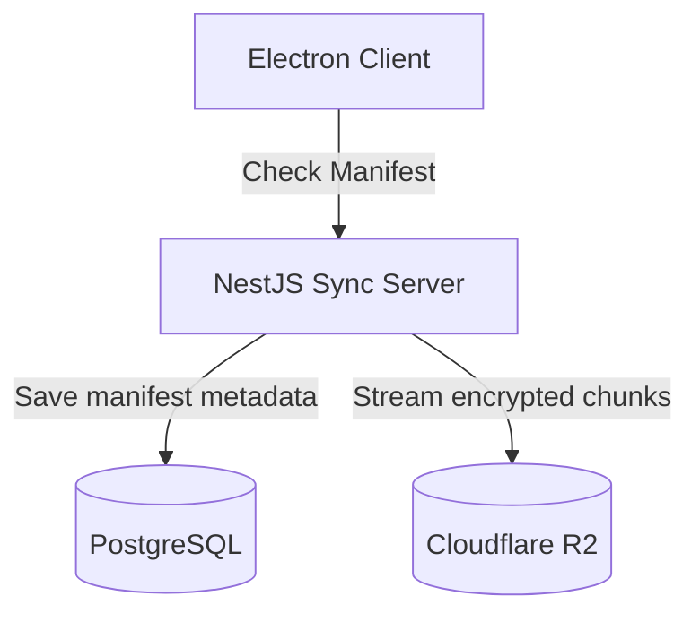
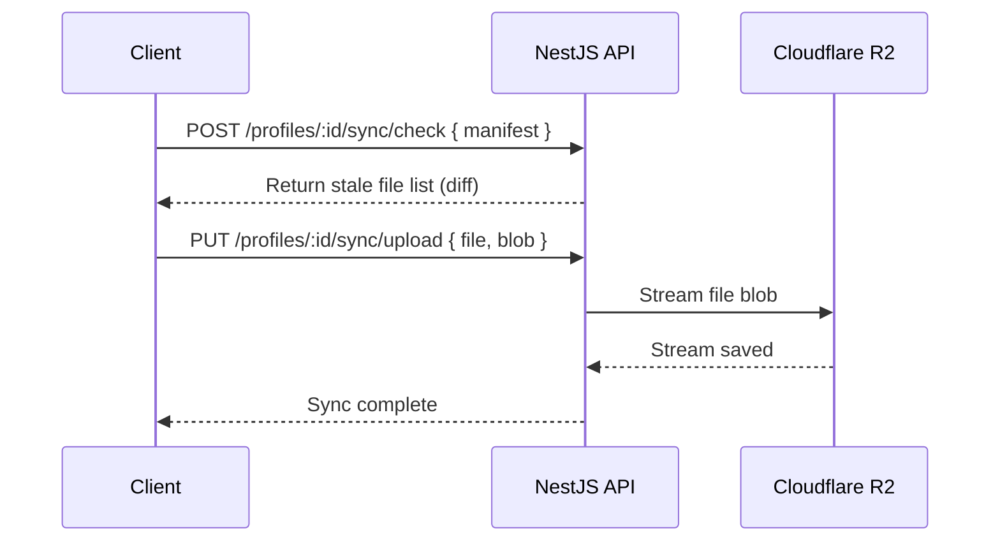

# RFC-0014: Cloud Sync Architecture (NestJS)

*   **Status**: Proposed
*   **Author**: Backend Lead
*   **Decided**: 2026-07-16

---

## 1. Background
To support multi-device session continuity, faked profiles cookie stores, localstorage files, and credentials must be synchronized to the Cloud database.

## 2. Problem Statement
Writing raw SQLite files directly to the server causes network congestion. We need delta manifest mapping so that only modified index blocks are uploaded.

## 3. Goals
- Deploy a NestJS Sync controller.
- Store encrypted profiles using S3 compatibility buckets (AWS/Cloudflare R2).
- Enforce encrypted headers validation.

## 4. Non-Goals
- Decrypting user files on the server (Server is blind).

## 5. Functional Requirements
- Sync status queries via file hash checksums.
- Multipart uploading of encrypted database chunks.

## 6. Non-Functional Requirements
- Support uploads up to 50MB.
- R2 upload processing latency < 200ms.

## 7. Architecture


## 8. Sequence Diagram


## 9. Data Model
```sql
CREATE TABLE sync_records (
  id SERIAL PRIMARY KEY,
  profile_id TEXT NOT NULL,
  file_path TEXT NOT NULL,
  file_hash TEXT NOT NULL,
  s3_key TEXT NOT NULL,
  updated_at TIMESTAMP
);
```

## 10. API Contract
- `POST /api/v1/profiles/:id/sync/check` — Check manifest diff.
- `PUT /api/v1/profiles/:id/sync/upload` — Multipart upload.

## 11. State Machine
*   `UP_TO_DATE` ➔ `SYNCING` ➔ `UP_TO_DATE`

## 12. Configuration
*   `S3_BUCKET_NAME`
*   `S3_ENDPOINT` (e.g. Cloudflare R2 link)

## 13. Error Handling
- Upload timeout: return `UPLOAD_TIMEOUT`, resume from offset.
- Lock conflict: return `PROFILE_LOCKED_BY_OTHER_CLIENT`.

## 14. Security Considerations
- Payload encryption keys are never sent to NestJS.
- S3 signed URLs used for direct client-to-S3 uploads to reduce server memory load.

## 15. Performance
- Streaming direct upload to Cloudflare R2 bypasses NestJS memory buffer heap.

## 16. Testing Strategy
- Integration tests simulating network failures mid-upload.

## 17. Rollout Plan
- Beta testing with limited bucket scopes.

## 18. Open Questions
- Max bucket retention storage sizes per user tier?

## 19. Future Improvements
- Compress index databases with Brotli instead of Gzip.

## 20. Appendix
- See [RFC-0013](RFC-0013-Cookie-Sync.md) for local file scanning details.
