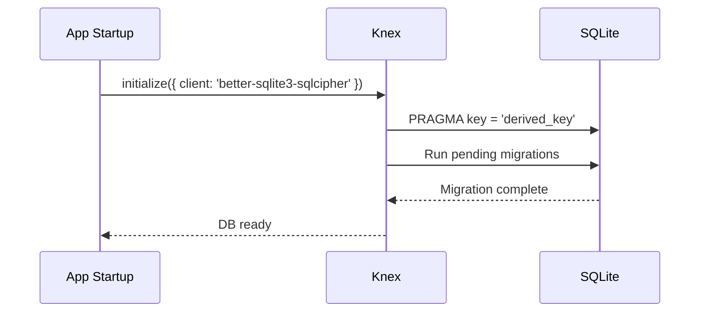

# RFC-0015: SQLite Local Database

*   **Status**: Proposed
*   **Author**: Backend Lead
*   **Decided**: 2026-07-16

---

## 1. Background
All profile configs, proxy settings, fingerprint snapshots, sync manifests, and audit logs need to be stored locally. SQLite is the ideal embedded database for the Electron environment.

## 2. Problem Statement
Without a structured local database, profile data would be stored in unversioned JSON files, making migrations, queries, and integrity checks unreliable.

## 3. Goals
- Design a complete SQLite schema for all local data.
- Encrypt the database at rest using SQLCipher.
- Support schema migrations via Knex.js.

## 4. Non-Goals
- Cloud database schema (PostgreSQL) — see RFC-0006.
- Real-time replication between devices.

## 5. Functional Requirements
- CRUD operations for profiles, proxies, teams, workspaces.
- Sync manifest tracking per profile.
- Audit log for all profile actions.

## 6. Non-Functional Requirements
- All queries < 10ms for datasets up to 10,000 profiles.
- Database file encrypted at rest (SQLCipher AES-256-GCM).
- Schema migrations auto-applied on app startup.

## 7. Architecture
```text
apps/desktop-client/
└── db/
    ├── migrations/
    │   ├── 001_create_profiles.js
    │   ├── 002_create_workspaces.js
    │   └── 003_create_audit_logs.js
    ├── knexfile.js
    └── client.js          ← Knex instance (SQLCipher)
```

## 8. Sequence Diagram


## 9. Data Model
```sql
-- Profiles table
CREATE TABLE profiles (
  id           TEXT PRIMARY KEY,
  workspace_id TEXT REFERENCES workspaces(id),
  name         TEXT NOT NULL,
  os           TEXT NOT NULL DEFAULT 'windows',
  browser      TEXT NOT NULL DEFAULT 'chrome',
  proxy_id     TEXT REFERENCES proxies(id),
  fingerprint  TEXT,            -- JSON blob
  user_data_dir TEXT NOT NULL,
  status       TEXT DEFAULT 'stopped',
  notes        TEXT,
  created_at   INTEGER NOT NULL,
  updated_at   INTEGER NOT NULL
);

-- Proxies table
CREATE TABLE proxies (
  id       TEXT PRIMARY KEY,
  label    TEXT NOT NULL,
  protocol TEXT NOT NULL,       -- socks5 | http | https
  host     TEXT NOT NULL,
  port     INTEGER NOT NULL,
  username TEXT,
  password TEXT,                -- AES-256-GCM encrypted
  created_at INTEGER NOT NULL
);

-- Workspaces (Profile Groups)
CREATE TABLE workspaces (
  id         TEXT PRIMARY KEY,
  name       TEXT NOT NULL,
  created_at INTEGER NOT NULL
);

-- Sync Manifest
CREATE TABLE sync_manifests (
  profile_id   TEXT REFERENCES profiles(id),
  file_path    TEXT NOT NULL,
  file_hash    TEXT NOT NULL,
  synced_at    INTEGER NOT NULL,
  PRIMARY KEY (profile_id, file_path)
);

-- Audit Logs
CREATE TABLE audit_logs (
  id         INTEGER PRIMARY KEY AUTOINCREMENT,
  profile_id TEXT,
  action     TEXT NOT NULL,    -- LAUNCH | STOP | CREATE | DELETE | SYNC
  metadata   TEXT,             -- JSON
  created_at INTEGER NOT NULL
);
```

## 10. API Contract
All DB operations exposed via Knex query builder. No raw SQL in business logic.

## 11. State Machine
Database lifecycle: `UNINITIALIZED` → `MIGRATING` → `READY` → `CLOSED`.

## 12. Configuration
```javascript
// knexfile.js
module.exports = {
  client: 'better-sqlite3',
  connection: { filename: process.env.LOCAL_DB_PATH },
  useNullAsDefault: true,
  pool: { min: 1, max: 1 }  // SQLite: single connection
};
```

## 13. Error Handling
- Migration failure: rollback transaction, show error dialog with log path.
- Decryption failure (wrong key): show "Database locked" prompt.
- Disk full: catch SQLITE_FULL error, alert user with cleanup guide.

## 14. Security Considerations
- Database key derived from user master password via Argon2id.
- Never store master password or derived key in memory longer than needed.
- WAL journal file also encrypted by SQLCipher.

## 15. Performance
- Index `profiles.status` for quick "running profiles" queries.
- Index `audit_logs.profile_id` for per-profile audit fetching.
- Batch writes inside transactions for bulk profile imports.

## 16. Testing Strategy
- Unit: Each migration produces expected schema.
- Integration: CRUD operations on all tables.
- Security: Verify DB file is unreadable without correct key.

## 17. Rollout Plan
- Ship with Milestone 3.

## 18. Open Questions
- Should we support exporting DB to plain JSON for backup?
- Migration downgrade support (rollback)?

## 19. Future Improvements
- Full-text search on profile names and notes.
- Time-series audit log visualization.

## 20. Appendix
- See [RFC-0005](RFC-0005-Profile-Management.md) for profile CRUD operations.
- See [RFC-0020](RFC-0020-Security.md) for key derivation specs.
