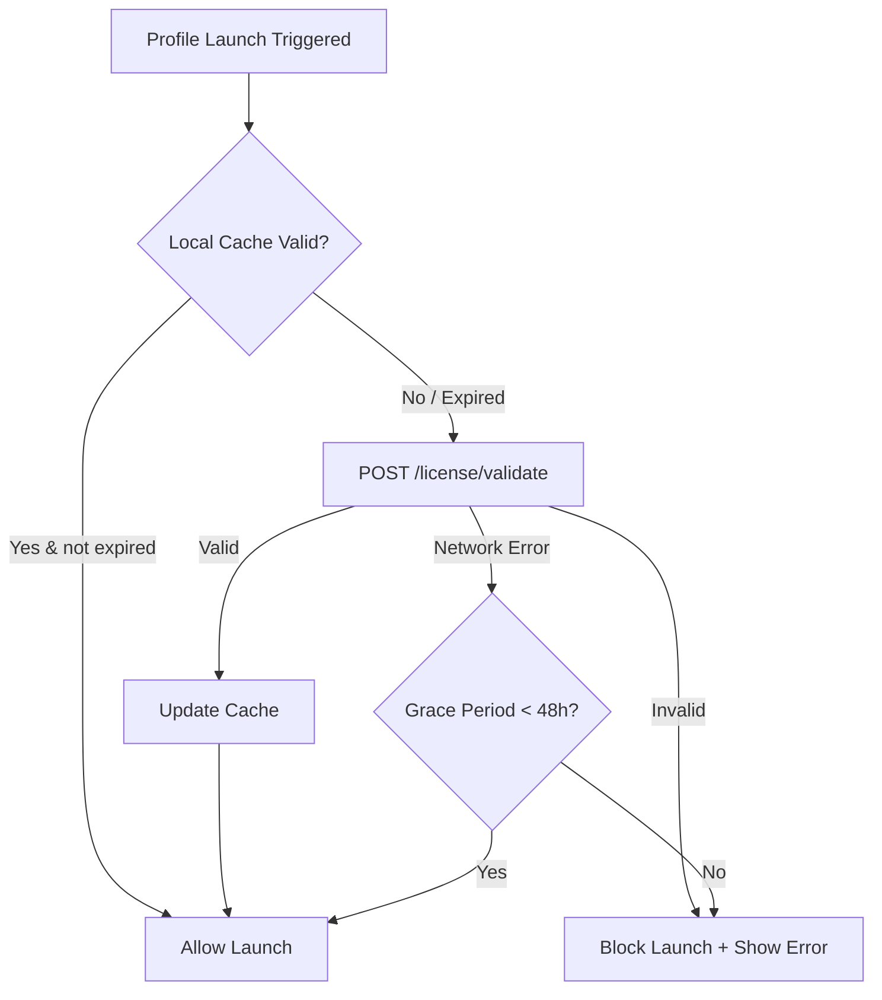
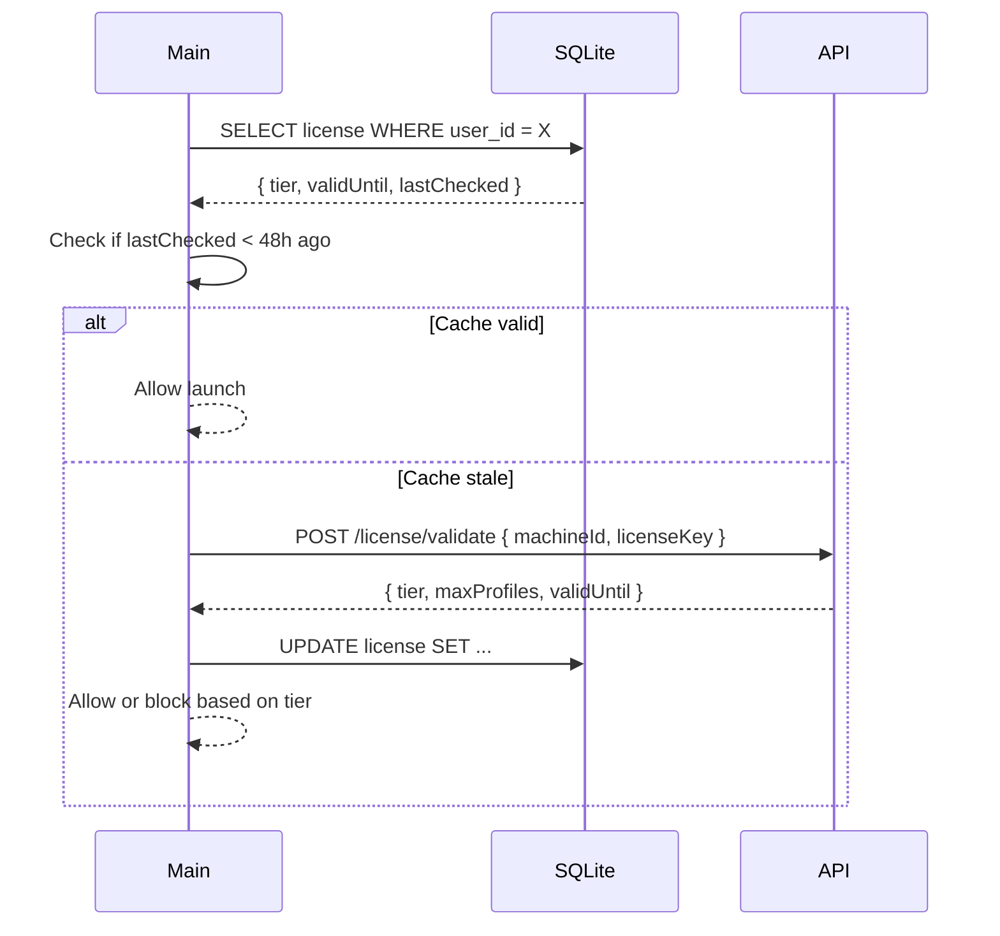

# RFC-0016: License & Subscription Management

*   **Status**: Proposed
*   **Author**: Backend Lead
*   **Decided**: 2026-07-16

---

## 1. Background
The product is a paid SaaS. License enforcement prevents unauthorized usage and enables tiered feature sets (Starter, Pro, Enterprise).

## 2. Problem Statement
Offline-capable desktop apps make license enforcement difficult — simply blocking network calls doesn't work if the app caches a valid token.

## 3. Goals
- Enforce license checks on every profile launch.
- Support offline grace period (48 hours without Cloud validation).
- Tier-based feature gates (profile count limits, team seats).

## 4. Non-Goals
- Anti-piracy DRM or binary obfuscation.
- Payment processing (handled by Stripe webhook).

## 5. Functional Requirements
- On launch: validate license against Cloud API.
- Cache license state locally for offline grace period.
- Block profile launch if license expired or exceeded.
- Show upgrade prompt when approaching tier limits.

## 6. Non-Functional Requirements
- License check latency: < 500ms.
- Offline grace period: 48 hours from last valid check.
- License state cached in SQLite with last-validated timestamp.

## 7. Architecture


## 8. Sequence Diagram


## 9. Data Model
```sql
CREATE TABLE license (
  user_id       TEXT PRIMARY KEY,
  license_key   TEXT NOT NULL,
  tier          TEXT NOT NULL,      -- starter | pro | enterprise
  max_profiles  INTEGER NOT NULL,
  max_team_seats INTEGER NOT NULL,
  valid_until   INTEGER NOT NULL,   -- Unix timestamp
  last_checked  INTEGER NOT NULL,
  machine_id    TEXT NOT NULL
);
```

## 10. API Contract
```
POST /api/v1/license/validate
Body: { licenseKey, machineId }
Response: {
  tier: 'pro',
  maxProfiles: 100,
  maxTeamSeats: 5,
  validUntil: 1784000000
}
```

## 11. State Machine
```
License: UNCHECKED → VALIDATING → VALID → EXPIRED
                                ↘ INVALID
                                ↘ GRACE_PERIOD
```

## 12. Configuration
- `LICENSE_GRACE_PERIOD_MS`: default 172800000 (48 hours)
- `LICENSE_CHECK_INTERVAL_MS`: default 3600000 (1 hour)

## 13. Error Handling
- `INVALID_LICENSE`: show "License Invalid" modal, block all launches.
- `EXCEEDED_PROFILE_LIMIT`: show upgrade prompt, block new profile creation.
- `NETWORK_ERROR` within grace period: allow with warning toast.

## 14. Security Considerations
- Machine ID derived from hardware fingerprint (not spoofable by product's own evasions).
- License key hashed before storage in SQLite.
- License API endpoint rate-limited (10 requests/minute per IP).

## 15. Performance
- License check cached for 1 hour in SQLite to avoid repeated API calls.

## 16. Testing Strategy
- Unit: Grace period calculation logic.
- Integration: Expired license blocks launch.
- Mock: Simulate network failure and verify grace period behavior.

## 17. Rollout Plan
- Ship with Milestone 4 (Electron App).

## 18. Open Questions
- Should machine transfers be supported (deactivate old, activate new)?
- Trial license duration?

## 19. Future Improvements
- Team license seat management UI.
- Usage analytics dashboard per license.

## 20. Appendix
- See [RFC-0006](RFC-0006-Workspace.md) for team/workspace management.
