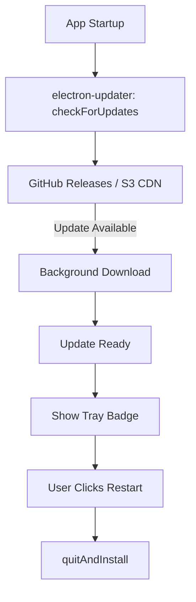
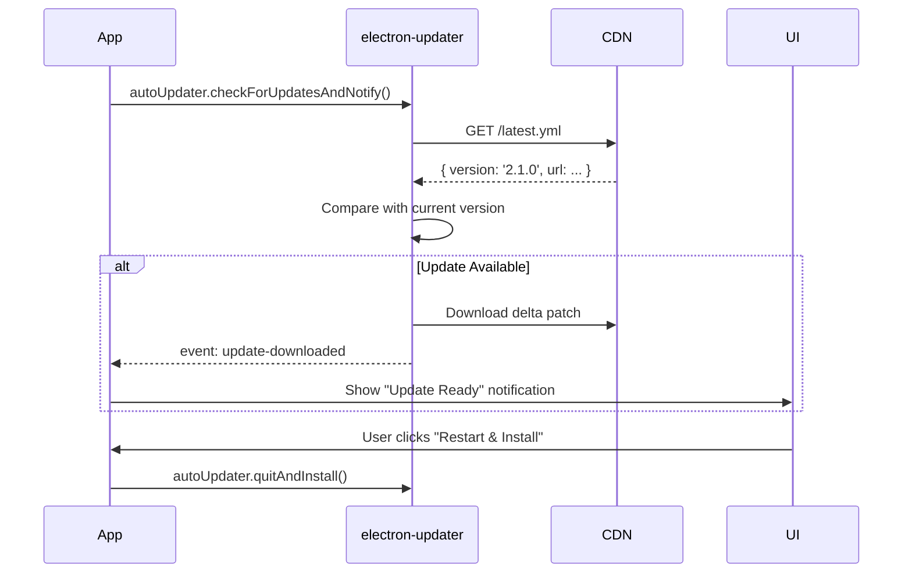

# RFC-0017: Auto-Update System

*   **Status**: Proposed
*   **Author**: DevOps
*   **Decided**: 2026-07-16

---

## 1. Background
Desktop apps require a reliable auto-update mechanism to deliver security patches, fingerprint model updates, and feature releases without requiring manual reinstallation.

## 2. Problem Statement
Electron apps need delta updates to avoid downloading 150MB+ packages for each release. Users on slow connections must not be blocked from using the app during updates.

## 3. Goals
- Background delta updates using `electron-updater`.
- Update notification in UI with changelog.
- Rollback capability if update causes instability.

## 4. Non-Goals
- Fingerprint CPT model updates (separate CDN distribution, see RFC-0007).
- Force-update enforcement (deferred).

## 5. Functional Requirements
- Check for updates on app startup and every 24 hours.
- Download update in background without interrupting usage.
- Show update-available badge in system tray.
- Prompt user to restart to apply update.
- Rollback to previous version on repeated crash after update.

## 6. Non-Functional Requirements
- Delta update size < 30MB for minor versions.
- Update check latency < 2 seconds.
- Background download must not impact browser launch performance.

## 7. Architecture


## 8. Sequence Diagram


## 9. Data Model
- `latest.yml` release manifest on CDN:
```yaml
version: 2.1.0
path: MidnightBrowser-2.1.0.exe
sha512: abc123...
releaseDate: 2026-07-16
```

## 10. API Contract
No REST API — uses file-based CDN manifest (`latest.yml` / `latest-mac.yml`).

## 11. State Machine
```
Updater: IDLE → CHECKING → NO_UPDATE
                         ↘ DOWNLOADING → READY → INSTALLING
```

## 12. Configuration
```javascript
// main.js
autoUpdater.setFeedURL({
  provider: 's3',
  bucket: 'midnight-browser-releases',
  region: 'us-east-1'
});
autoUpdater.checkForUpdatesAndNotify();
```

## 13. Error Handling
- CDN unreachable: fail silently, retry on next startup.
- Corrupted download (SHA512 mismatch): delete partial file, retry.
- Rollback: keep previous version installer in `%TEMP%` for 7 days.

## 14. Security Considerations
- All update packages must be code-signed (Windows: EV certificate; macOS: notarized).
- SHA512 checksum verified before installation.
- Update URL must use HTTPS with certificate pinning.

## 15. Performance
- Delta updates use `electron-builder` differential updates (NSIS block-map).
- Download throttled to 50% of available bandwidth to not disrupt browsing.

## 16. Testing Strategy
- Unit: Updater state machine transitions.
- Integration: Full update cycle in dev environment.
- Manual: Windows NSIS installer verification.

## 17. Rollout Plan
- Staged rollout: 5% → 25% → 100% of user base.
- Rollback mechanism monitored via Sentry crash reports.

## 18. Open Questions
- Should we support forced security updates for critical vulnerabilities?

## 19. Future Improvements
- In-app changelog viewer with Markdown rendering.
- Update scheduling (update at specific time to avoid disruption).

## 20. Appendix
- See [electron-updater docs](https://www.electron.build/auto-update).
- See DevOps CI/CD pipeline for release build automation.
