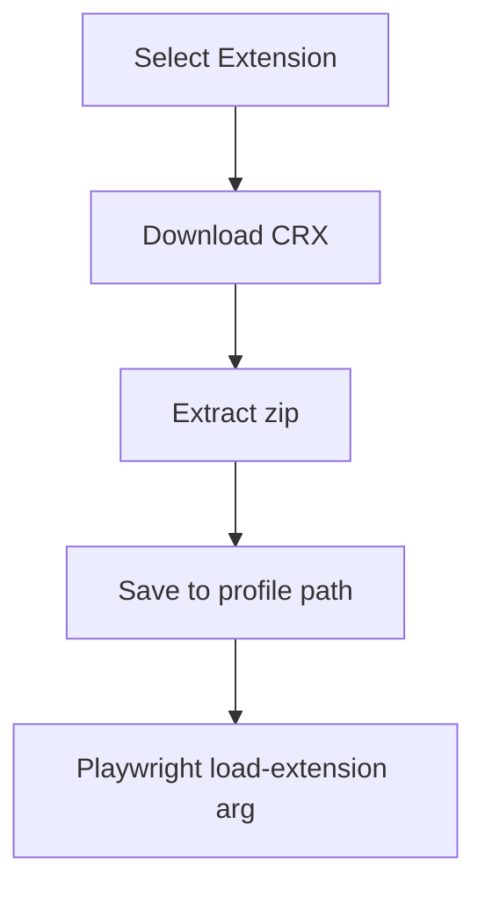
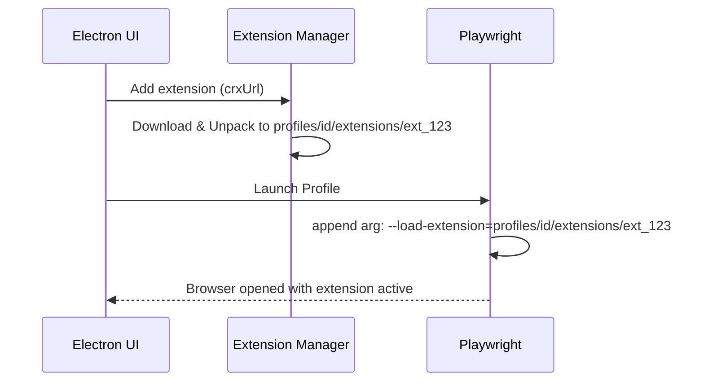

# RFC-0018: Browser Extensions Management

*   **Status**: Proposed
*   **Author**: Browser Lead
*   **Decided**: 2026-07-16

---

## 1. Background
Users want to install Chrome Extensions (Adblock, Metamask) inside their profile sessions. Each profile must load extensions independently.

## 2. Problem Statement
Chrome extensions can leak automation metrics. If Playwright loads extensions globally, the browser cannot run in default stealth mode because extensions can query internal CDP hooks.

## 3. Goals
- Support loading unpacked extensions per profile.
- Secure extension parameters, blocking execution path leaks.

## 4. Non-Goals
- Firefox extensions support (Chromium MV3 only).

## 5. Functional Requirements
- Load extensions from Chrome Web Store (CRX parsing).
- Extract extension binaries to `profiles/[uuid]/extensions/`.
- Append launch arguments to Playwright: `--load-extension=...`.

## 6. Non-Functional Requirements
- Launch latency overhead < 500ms with 3 active extensions.

## 7. Architecture


## 8. Sequence Diagram


## 9. Data Model
```sql
CREATE TABLE profile_extensions (
  profile_id TEXT REFERENCES profiles(id),
  extension_id TEXT NOT NULL,
  name TEXT NOT NULL,
  version TEXT NOT NULL,
  local_path TEXT NOT NULL,
  PRIMARY KEY (profile_id, extension_id)
);
```

## 10. API Contract
Extends profile options with `extensionPaths: string[]`.

## 11. State Machine
*   `UNINSTALLED` ➔ `DOWNLOADING` ➔ `INSTALLED` ➔ `LOADED`

## 12. Configuration
*   Max allowed active extensions per profile: 10.

## 13. Error Handling
- Extension loading failure: log error, launch browser without extension.
- Manifest V2 deprecation check: warn user on upload.

## 14. Security Considerations
- Extensions running in profile context can access cookies. Sandbox check extensions to prevent local credentials leakage.

## 15. Performance
- Unpacked CRX cached locally to prevent downloading on every run.

## 16. Testing Strategy
- Verify extension page loads and registers inside `chrome://extensions/`.

## 17. Rollout Plan
- Beta launch in Milestone 4.

## 18. Open Questions
- How to support extension auto-updates?

## 19. Future Improvements
- Private extension marketplace integration.

## 20. Appendix
- Chromium Extension loading specs.
