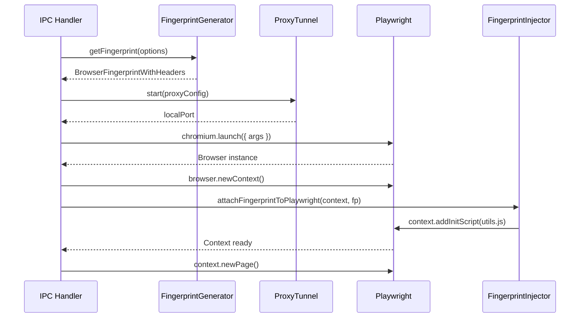

# RFC-0019: Playwright Launcher

*   **Status**: Approved
*   **Author**: Desktop Lead
*   **Decided**: 2026-07-16

---

## 1. Background
The Playwright Launcher is the bridge between the Electron GUI and the Chromium browser process. It is responsible for applying the fingerprint, configuring proxy routing, and managing the browser lifecycle.

## 2. Problem Statement
The launcher must atomically apply fingerprint injections *before* the first page request fires, otherwise race conditions allow detection scripts to read native values.

## 3. Goals
- Atomic fingerprint injection using `context.addInitScript()`.
- Proxy routing via local tunnel (no credential dialogs).
- Lifecycle management: launch, monitor, stop, crash-recover.

## 4. Non-Goals
- Automation scripts (user scripts run inside the launched browser).
- Extension management.

## 5. Functional Requirements
- Launch Chromium with stealth args and fingerprint injection.
- Route all traffic through per-profile proxy tunnel.
- Monitor browser process; emit events on crash.
- Clean shutdown: close context → close browser → kill tunnel.

## 6. Non-Functional Requirements
- Fingerprint injection must complete before first network request.
- Launch time < 3 seconds on standard hardware.
- Zero IP leaks if proxy is configured but fails.

## 7. Architecture
```javascript
// Launcher flow
const { FingerprintGenerator } = require('fingerprint-generator');
const { FingerprintInjector } = require('fingerprint-injector');
const playwright = require('playwright');

async function launchProfile(config) {
  // 1. Generate fingerprint
  const fg = new FingerprintGenerator();
  const fp = fg.getFingerprint({ browsers: ['chrome'], operatingSystems: ['windows'] });

  // 2. Start proxy tunnel
  const tunnel = await startProxyTunnel(config.proxy);

  // 3. Launch browser
  const browser = await playwright.chromium.launch({
    headless: false,
    args: [
      `--user-data-dir=${config.userDataDir}`,
      `--proxy-server=http://127.0.0.1:${tunnel.localPort}`,
      '--disable-blink-features=AutomationControlled',
    ]
  });

  // 4. Inject fingerprint (atomic: before any page load)
  const context = await browser.newContext();
  const injector = new FingerprintInjector();
  await injector.attachFingerprintToPlaywright(context, fp);

  return { browser, context, tunnel };
}
```

## 8. Sequence Diagram


## 9. Data Model
```typescript
interface LauncherResult {
  browser: Browser;
  context: BrowserContext;
  tunnel: ProxyTunnel;
  pid: number;
}

interface ProxyTunnel {
  localPort: number;
  stop(): Promise<void>;
}
```

## 10. API Contract
```typescript
export async function launchProfile(config: BrowserLaunchConfig): Promise<LauncherResult>;
export async function stopProfile(result: LauncherResult): Promise<void>;
```

## 11. State Machine
```
Launcher: IDLE → GENERATING_FP → STARTING_TUNNEL → LAUNCHING_BROWSER → INJECTING → RUNNING → STOPPING → IDLE
                                                                                            ↘ CRASHED
```

## 12. Configuration
```typescript
const STEALTH_ARGS = [
  '--disable-blink-features=AutomationControlled',
  '--disable-infobars',
  '--no-first-run',
  '--disable-extensions-except=', // Allow specific extensions only
  '--use-fake-ui-for-media-stream',
];
```

## 13. Error Handling
- Proxy tunnel fails to start: abort launch, never open browser with real IP.
- `addInitScript` fails: close browser immediately, log error.
- Browser process dies unexpectedly: emit `profile:crashed`, attempt state save.

## 14. Security Considerations
- All file paths (userDataDir) sanitized via `path.resolve()` with allowed-root check.
- Proxy credentials never passed via CLI args (use tunnel only).
- CDP port not exposed externally.

## 15. Performance
- Pre-generate fingerprints at profile creation time (lazy init pattern).
- Reuse browser context for continued sessions instead of full re-launch.

## 16. Testing Strategy
- Verify `navigator.webdriver === false` post-launch.
- Verify `WebGLRenderingContext.getParameter(UNMASKED_RENDERER_WEBGL)` returns faked GPU.
- Verify proxy routing via external IP check API.
- Verify no memory leak after 100 launch/stop cycles.

## 17. Rollout Plan
- Phase 1: Playwright Chromium (stock binary).
- Phase 2: Patched binary with C++ canvas noise.

## 18. Open Questions
- Should we support CDP remote debugging for power users?

## 19. Future Improvements
- Headless mode optimization for scraping use cases.
- Multi-tab management per profile.

## 20. Appendix
- See [RFC-0004](RFC-0004-Browser-Engine.md) for Chromium launch configuration.
- See [RFC-0012](RFC-0012-Proxy-Authentication.md) for proxy tunnel implementation.
- See `test_evasion.js` for working example.
