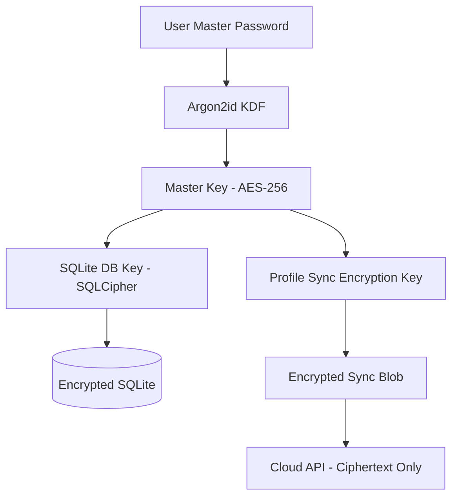
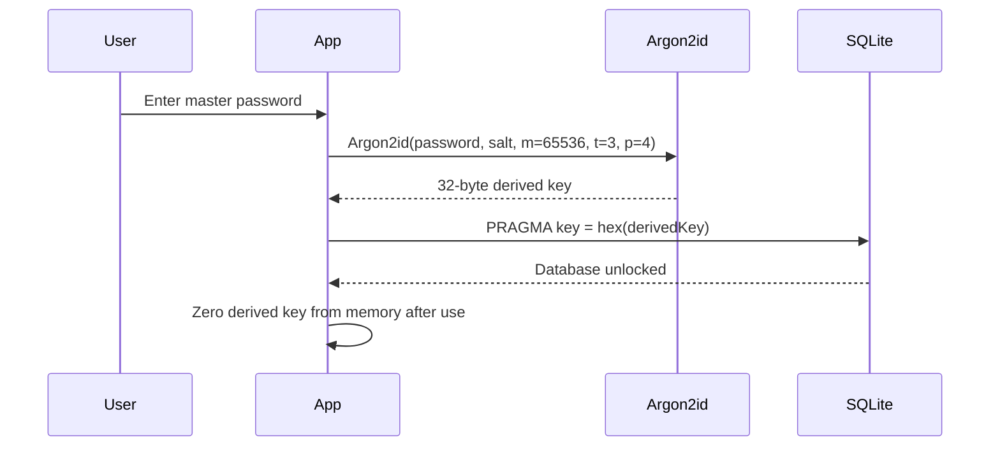

# RFC-0020: Security Architecture

*   **Status**: Proposed
*   **Author**: Security Lead
*   **Decided**: 2026-07-16

---

## 1. Background
The product handles sensitive user data: proxy credentials, session cookies, login tokens, and payment information. A comprehensive security architecture is required to protect user data at rest, in transit, and in memory.

## 2. Problem Statement
An anti-detect browser is a high-value target. Compromising it exposes users' entire web identity: accounts, sessions, and credentials across hundreds of profiles.

## 3. Goals
- Zero-knowledge architecture: Cloud server cannot read user session data.
- Local data encrypted at rest using derived keys.
- Secure IPC prevents renderer-side code injection.
- Audit trail for all profile operations.

## 4. Non-Goals
- Anti-tamper binary protection (deferred).
- FIPS-140 certification.

## 5. Functional Requirements
- SQLite database encrypted with SQLCipher (AES-256-GCM).
- Sync payloads encrypted client-side before upload.
- Proxy passwords encrypted in SQLite.
- All Cloud API calls over HTTPS (TLS 1.3).
- IPC: `contextIsolation: true`, no `nodeIntegration`.

## 6. Non-Functional Requirements
- Key derivation: < 2 seconds on standard hardware.
- No plaintext credentials in log files.
- Memory: derived keys zeroed after use.

## 7. Architecture


## 8. Sequence Diagram


## 9. Data Model
```sql
-- Key metadata (salt stored unencrypted, key derived on login)
CREATE TABLE key_metadata (
  user_id     TEXT PRIMARY KEY,
  salt        BLOB NOT NULL,    -- 32-byte random Argon2id salt
  kdf_params  TEXT NOT NULL,    -- JSON: { m, t, p, version }
  created_at  INTEGER NOT NULL
);
```

## 10. API Contract
No API — key management is entirely local. Cloud never receives key material.

## 11. State Machine
```
Session: LOCKED → UNLOCKING → UNLOCKED → LOCKING → LOCKED
```
Auto-lock after 30 minutes of inactivity.

## 12. Configuration
```javascript
const KDF_PARAMS = {
  algorithm: 'argon2id',
  memoryCost: 65536,   // 64 MB
  timeCost: 3,
  parallelism: 4,
  keyLength: 32        // 256-bit AES key
};
```

## 13. Error Handling
- Wrong master password: 3 attempts allowed, then 30-second cooldown (exponential backoff).
- Database corruption: prompt to restore from last sync backup.
- Memory allocation failure for KDF: abort unlock, show error.

## 14. Security Considerations
- **Argon2id parameters**: `m=65536` (64MB memory), `t=3` (3 iterations), `p=4` (4 threads) — resistant to GPU brute force.
- **No password storage**: only salt stored; key re-derived on each login.
- **IPC security**: renderer cannot invoke `fs`, `child_process`, or `net` Node modules directly.
- **Audit logs**: all critical operations logged with timestamp and action type.
- **Threat model**: see [System/Security.md](../System/Security.md).

## 15. Performance
- Argon2id with recommended params: ~500ms on standard hardware (acceptable for login).
- SQLCipher overhead: < 5% compared to unencrypted SQLite.

## 16. Testing Strategy
- Unit: KDF produces deterministic key for same password + salt.
- Integration: Unlock → read data → lock → verify DB unreadable.
- Penetration: Attempt IPC injection from renderer, verify blocked by contextIsolation.

## 17. Rollout Plan
- Ship with Milestone 3 (Database & Cloud Sync).
- Security audit before Milestone 4 (Production release).

## 18. Open Questions
- Should we support biometric unlock (Windows Hello, Touch ID)?
- Hardware key support (YubiKey)?

## 19. Future Improvements
- DPAPI integration for Windows keychain-backed key storage.
- macOS Keychain integration for master key backup.

## 20. Appendix
- [RFC-0015](RFC-0015-SQLite-Database.md) for SQLite schema.
- [RFC-0013](RFC-0013-Cookie-Sync.md) for sync encryption flow.
- OWASP Cryptographic Storage Cheat Sheet.
