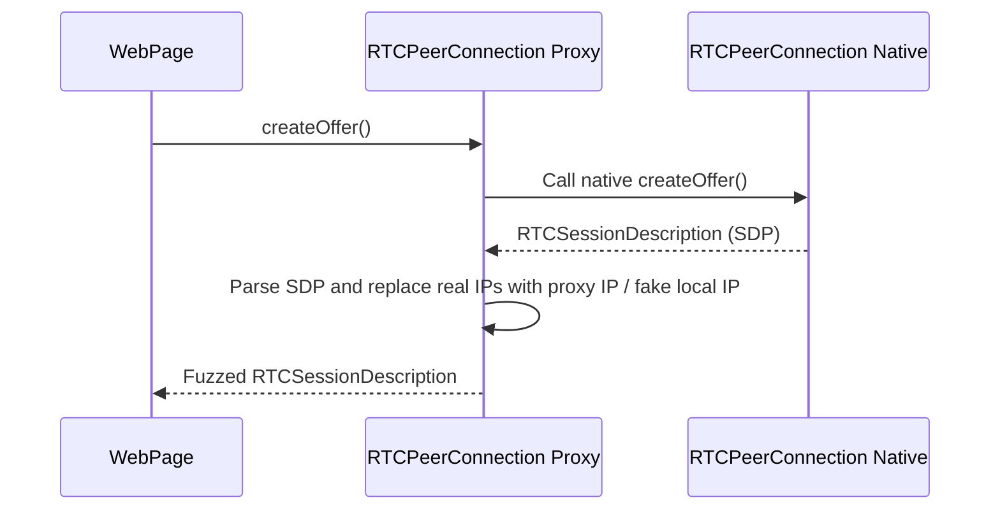

# RFC-0021: WebRTC Leak Prevention

*   **Status**: Proposed
*   **Author**: Browser Lead
*   **Decided**: 2026-07-16

---

## 1. Background
WebRTC (Web Real-Time Communication) provides APIs (`RTCPeerConnection`) to establish peer-to-peer connections. However, standard WebRTC queries bypass proxies to discover local and public IP addresses (IP leaks).

## 2. Problem Statement
If a profile uses a proxy but WebRTC queries reveal the user's real public/local IP, anti-bots will instantly detect the mismatch and flag the account.

## 3. Goals
- Force WebRTC traffic through the profile's configured proxy.
- Spoof/disable candidate gathering of local IP addresses (RFC 1918).
- Keep real-time communication functioning (e.g. Google Meet, Discord) when requested.

## 4. Non-Goals
- Custom WebRTC media codecs spoofing (handled in Codecs spec).

## 5. Functional Requirements
- Block host local IP leaks in candidate parameters.
- Provide 3 modes: `Block` (disable WebRTC), `Spoof` (override IPs), and `Forward` (force proxy routing).

## 6. Non-Functional Requirements
- Overhead on connection initialization < 10ms.

## 7. Architecture
```text
WebRTC API Call ➔ RTCPeerConnection Proxy ➔ Filter Candidates ➔ Route to Proxy
```

## 8. Sequence Diagram


## 9. Data Model
Configuration mapping:
```typescript
interface WebRTCConfig {
  mode: 'disabled' | 'forward' | 'spoof';
  publicIp?: string;  // Proxy IP
  localIp?: string;   // Faked private IP (e.g. 192.168.1.55)
}
```

## 10. API Contract
Extends `window.RTCPeerConnection` prototype.

## 11. State Machine
Stateless override.

## 12. Configuration
Chromium command line flags applied on launch:
```bash
--force-webrtc-ip-handling=default_public_interface_only
```

## 13. Error Handling
- Capture and log WebRTC connection timeouts.

## 14. Security Considerations
- Ensure that the candidate filtering code never fails silently to expose real IP.

## 15. Performance
- Parsing SDP strings requires regex processing; optimized to run under 1ms.

## 16. Testing Strategy
- Verification using WebRTC leaks test sites (e.g., `browserleaks.com/webrtc`).

## 17. Rollout Plan
- Include in standard browser injections.

## 18. Open Questions
- Does blocking local candidate gathering impact P2P game latency?

## 19. Future Improvements
- Native WebRTC IP routing patch in custom Chromium builds.

## 20. Appendix
- RFC 8829 - Session Description Protocol (SDP).
