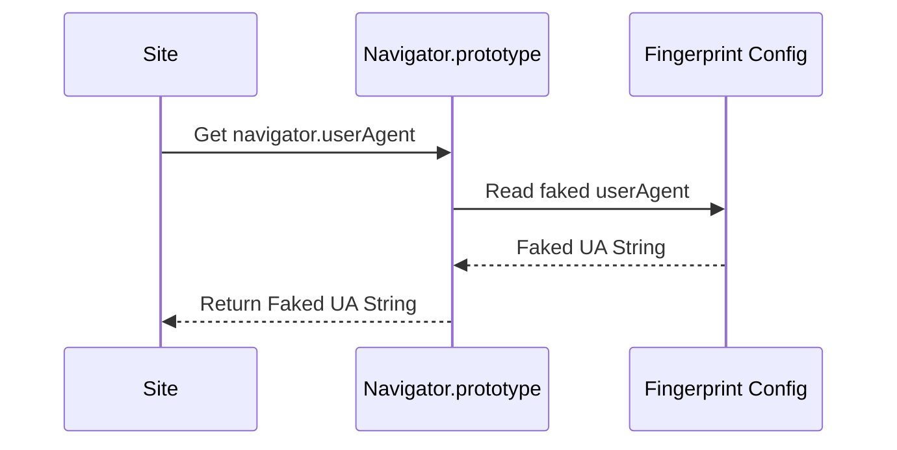

# RFC-0022: Navigator Overrides

*   **Status**: Proposed
*   **Author**: Browser Lead
*   **Decided**: 2026-07-16

---

## 1. Background
The `navigator` object leaks key browser metadata (User-Agent, Platform, hardware threads concurrency, memory size).

## 2. Problem Statement
Writing faked values directly onto instance properties (e.g. `navigator.webdriver = false`) is easily detected using `hasOwnProperty` audits. Anti-bots check if properties reside on prototype chains.

## 3. Goals
- Redefine navigator variables cleanly on `Navigator.prototype`.
- Spoof User-Agent, platform, hardwareConcurrency, deviceMemory, and maxTouchPoints.

## 4. Non-Goals
- Modifying navigator properties inside Chrome extensions scopes (handled separately).

## 5. Functional Requirements
- Redefine properties using `Object.defineProperty` on `Navigator.prototype`.
- Values must match faked profile configurations.

## 6. Non-Functional Requirements
- Overhead on property read < 0.001 microseconds.

## 7. Architecture
```text
Website calls navigator.userAgent ➔ Navigator.prototype getter proxy trap ➔ Faked userAgent returned
```

## 8. Sequence Diagram


## 9. Data Model
```typescript
interface NavigatorConfig {
  userAgent: string;
  platform: string;
  hardwareConcurrency: number;
  deviceMemory: number;
  maxTouchPoints: number;
}
```

## 10. API Contract
Extends `window.navigator`.

## 11. State Machine
Stateless initialization.

## 12. Configuration
Configs mapped at context startup.

## 13. Error Handling
- Illegal invocation check: if getter is called with a non-navigator context, throw standard `TypeError: Illegal invocation`.

## 14. Security Considerations
- Redefined getters must return native-like `.toString()` descriptions.

## 15. Performance
- Reading properties uses native getters; zero impact on script execution speed.

## 16. Testing Strategy
- Assert `navigator.hasOwnProperty('webdriver') === false`.
- Assert `Object.getPrototypeOf(navigator).hasOwnProperty('webdriver') === true`.

## 17. Rollout Plan
- Include in standard browser injections.

## 18. Open Questions
- How to handle `navigator.userAgentData` in modern Chrome versions? (We override `NavigatorUAData.prototype`).

## 19. Future Improvements
- C++ level native flag compilation overrides.

## 20. Appendix
- CreepJS Navigator checks specifications.
