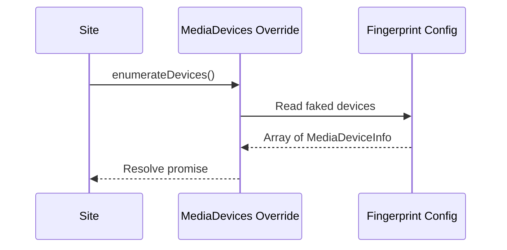

# RFC-0023: Battery & Media Device APIs

*   **Status**: Proposed
*   **Author**: Browser Lead
*   **Decided**: 2026-07-16

---

## 1. Background
Websites check battery status (`navigator.getBattery`) and hardware media devices list (`navigator.mediaDevices.enumerateDevices`) to verify the authenticity of the client.

## 2. Problem Statement
Default headless browsers return an empty list of media devices (no webcams, no mics) and battery level queries return static or charging-only states. These parameters instantly flag headless clients.

## 3. Goals
- Mock realistic media device lists.
- Mock dynamic battery draining cycles.

## 4. Non-Goals
- Real media routing (mock list is only for enumeration metadata).

## 5. Functional Requirements
- Override `navigator.mediaDevices.enumerateDevices` to return faked device structures.
- Override `navigator.getBattery` to resolve a faked BatteryManager promise.

## 6. Non-Functional Requirements
- Resolution time < 5ms.

## 7. Architecture
```text
Website calls enumerateDevices() ➔ MediaDevices.prototype override ➔ Mock array returned
```

## 8. Sequence Diagram


## 9. Data Model
```typescript
interface MediaDeviceInfoMock {
  deviceId: string;
  kind: 'audioinput' | 'audiooutput' | 'videoinput';
  label: string;
  groupId: string;
}
```

## 10. API Contract
Extends `window.navigator.mediaDevices`.

## 11. State Machine
*   `charging` (true/false), `level` (ranges from 1 to 0).

## 12. Configuration
*   Device count is generated based on standard PC configuration.

## 13. Error Handling
- Wrapper try-catch blocks to prevent breaking if permissions are blocked.

## 14. Security Considerations
- Return faked identifiers that remain identical within the same profile session.

## 15. Performance
- Instant resolution.

## 16. Testing Strategy
- Verify device list length is > 0 on `enumerateDevices()`.

## 17. Rollout Plan
- Include in standard browser injections.

## 18. Open Questions
- Should we mock virtual audio inputs?

## 19. Future Improvements
- Audio context connection overrides.

## 20. Appendix
- MDN enumerateDevices specifications.
