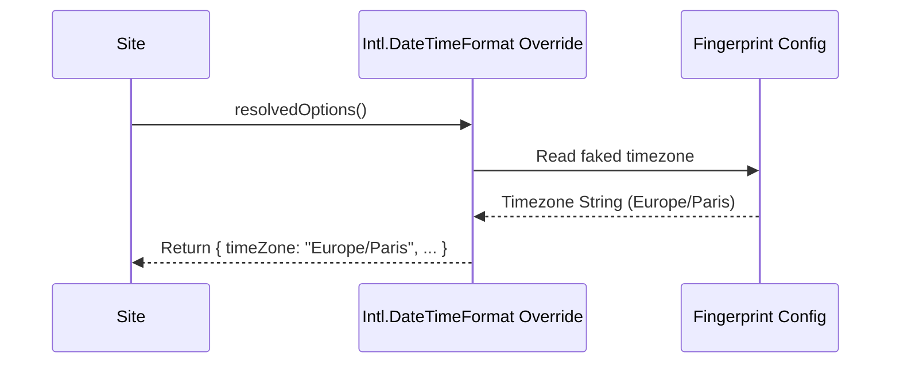

# RFC-0024: Timezone & Locale Spoofing

*   **Status**: Proposed
*   **Author**: Browser Lead
*   **Decided**: 2026-07-16

---

## 1. Background
Websites check user locations using timezone calls (`Intl.DateTimeFormat().resolvedOptions().timeZone`) and locale configurations (`navigator.language`).

## 2. Problem Statement
If a browser routes traffic through a French proxy, but the timezone query resolves to `Asia/Ho_Chi_Minh` (due to the host system clock settings) and navigator language returns `vi-VN`, the timezone mismatch flags the session as a proxy user.

## 3. Goals
- Override timezone strings dynamically to match the proxy geolocation.
- Override locale formatters (Intl) to match targeted profile language settings.

## 4. Non-Goals
- Modifying OS-level hardware time configurations.

## 5. Functional Requirements
- Override `Intl.DateTimeFormat.prototype.resolvedOptions`.
- Redefine timezone query return values.
- Override Date/Time string serialization helper methods (`Date.prototype.toLocaleString`).

## 6. Non-Functional Requirements
- Overhead per formatting execution < 0.01ms.

## 7. Architecture
```text
Website requests resolvedOptions() ➔ Intl.DateTimeFormat override ➔ Faked timezone returned (e.g. "Europe/Paris")
```

## 8. Sequence Diagram


## 9. Data Model
```typescript
interface LocaleConfig {
  timezone: string; // e.g. "Europe/Paris"
  locale: string;   // e.g. "fr-FR"
}
```

## 10. API Contract
Extends standard global `Intl` scope.

## 11. State Machine
Stateless initialization.

## 12. Configuration
Timezone configs map automatically to the proxy geolocation during profile launcher validation.

## 13. Error Handling
- Wrap overrides in robust validation checks to verify timezone ID strings are fully compliant.

## 14. Security Considerations
- Keep timezone offsets consistent across Date API calls to block differential discrepancies audits.

## 15. Performance
- Instant resolution.

## 16. Testing Strategy
- Assert `Intl.DateTimeFormat().resolvedOptions().timeZone` equals the target proxy timezone.

## 17. Rollout Plan
- Include in standard browser injections.

## 18. Open Questions
- Should we automatically calculate DST (Daylight Saving Time) changes? (Yes, handled by overriding offset calculations).

## 19. Future Improvements
- Patched timezone library wrapper compiling.

## 20. Appendix
- ECMA-402 Internationalization API Specification.
