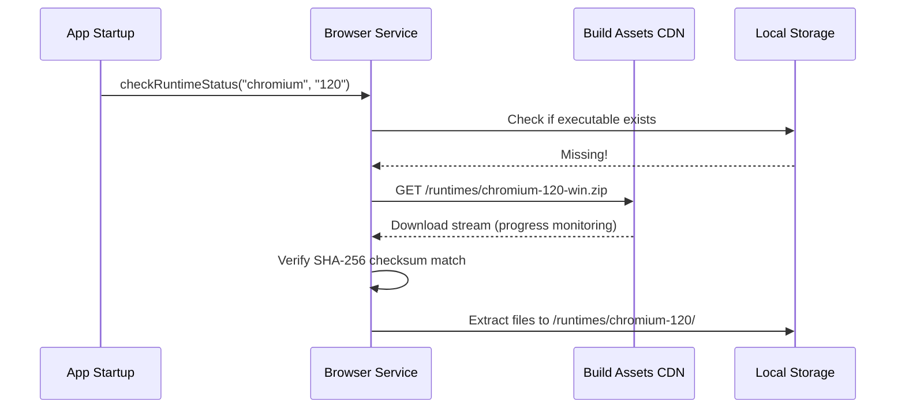

# Browser Service Specification

This service manages the download, version tracking, and integrity check of customized browser runtime packages.

---

## 1. README (Purpose)
Enables multiple, distinct browser runtime execution paths (Chromium, Firefox) on the same machine. Downloader hooks download builds from S3 bucket CDN.

---

## 2. Architecture
```text
BrowserService Controller
 ├── Downloader Stream Handler (Pipes CRX/ZIP files from CDN)
 ├── SHA-256 Checksum Validator (Verifies integrity)
 └── Path Resolver (Locates platform executable paths on Win/Mac/Linux)
```

---

## 3. API (Interfaces)
```typescript
interface BrowserService {
  checkRuntimeStatus(engine: string, version: string): Promise<'ready' | 'missing' | 'corrupt'>;
  downloadRuntime(engine: string, version: string, onProgress?: (p: number) => void): Promise<string>;
  getRuntimePath(engine: string, version: string): string;
  verifyChecksum(filePath: string, expectedHash: string): Promise<boolean>;
}
```

---

## 4. Sequence (Audit and Download)


---

## 5. Testing
*   **Hash Test**: Verify download throws error if SHA-256 signature does not match target.
*   **Execute Test**: Verify unpacked binaries are executable (check `chmod +x` assignment on Mac/Linux).
