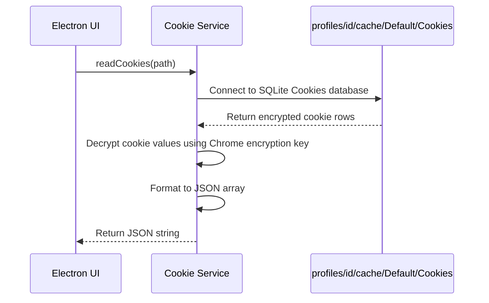

# Cookie Service Specification

This service manages profile cookie database extractions, JSON imports/exports, and encryption algorithms.

---

## 1. README (Purpose)
Handles cookie database reading (SQLite Cookies database file in user data folder), translates format structures (Netscape to JSON), and encrypts data.

---

## 2. Architecture
```text
Chromium Cookies DB ➔ SQLite Reader (Extract rows)
                          ├── Decrypt cookies (using OS Keychains)
                          ├── Parse to standard Netscape / JSON array
                          └── Encrypt using PBKDF2/AES-GCM-256 for Cloud Sync
```

---

## 3. API (Interfaces)
```typescript
interface CookieService {
  readCookies(userDataDir: string): Promise<Cookie[]>;
  writeCookies(userDataDir: string, cookies: Cookie[]): Promise<void>;
  exportToJson(cookies: Cookie[]): string;
  importFromJson(json: string): Cookie[];
  encryptCookies(cookies: Cookie[], key: Buffer): Promise<EncryptedBlob>;
  decryptCookies(blob: EncryptedBlob, key: Buffer): Promise<Cookie[]>;
}
```

---

## 4. Sequence (Export Flow)


---

## 5. Testing
*   **Decryption check**: Verify Chrome cookies can be successfully read and decrypted on Windows and macOS.
*   **Format check**: Verify imports/exports work correctly in both JSON and Netscape formats.
