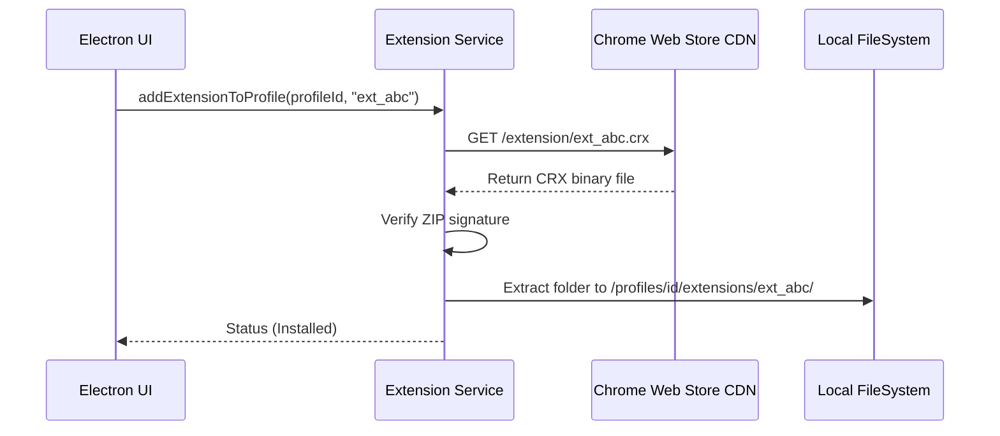

# Extension Service Specification

This service manages Chrome extension CRX downloads, unpacking, and profile injection paths.

---

## 1. README (Purpose)
Enables importing standard Chrome Web Store extensions into browser profiles by downloading, unpacking, and passing extension load arguments to Playwright Chromium launch sequences.

---

## 2. Architecture
```text
CWS extension ID ➔ CRX Downloader (Fetch CRX zip file)
                    ➔ Unpack stream (Extracts files to profile directory)
                    ➔ Manifest check (Validates MV3 / permissions)
                    ➔ Appends arg path (`--load-extension=...`)
```

---

## 3. API (Interfaces)
```typescript
interface ExtensionService {
  downloadExtension(extensionId: string): Promise<string>;
  unpackExtension(zipPath: string, targetPath: string): Promise<void>;
  getProfileExtensions(profileId: string): Promise<Extension[]>;
  addExtensionToProfile(profileId: string, extensionId: string): Promise<void>;
  removeExtensionFromProfile(profileId: string, extensionId: string): Promise<void>;
}
```

---

## 4. Sequence (Extension Load Flow)


---

## 5. Testing
*   **Launch verification**: Verify browser profiles open with installed extensions active.
*   **Corrupt check**: Verify CRX unpacking handles extraction errors without locking browser startup.
