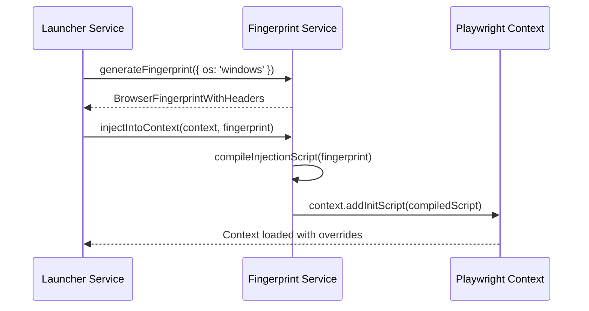

# Fingerprint Service Specification

This service manages the probability network generator, script injection, and browser faked variables.

---

## 1. README (Purpose)
Integrates `generative-bayesian-network` and `fingerprint-injector` to construct and inject faked platform variables inside browser sessions.

---

## 2. Architecture
```text
FingerprintService Controller
 ├── Bayesian Network Sampler (Calculates joint probabilities)
 ├── Evasion Script Compiler (Combines utils.js with faked config parameters)
 └── CDP Injector (Pushes overrides into Puppeteer/Playwright pages)
```

---

## 3. API (Interfaces)
```typescript
interface FingerprintService {
  generateFingerprint(constraints?: FingerprintConstraints): BrowserFingerprintWithHeaders;
  compileInjectionScript(fingerprint: BrowserFingerprintWithHeaders): string;
  injectIntoContext(context: any, fingerprint: BrowserFingerprintWithHeaders): Promise<void>;
}
```

---

## 4. Sequence (Compilation & Injection Flow)


---

## 5. Testing
*   **Coherency Check**: Assert that the output configuration does not combine incompatible operating systems and font rendering widths.
*   **Verification Check**: Verify that CreepJS yields a high trust score on browser initialization.
