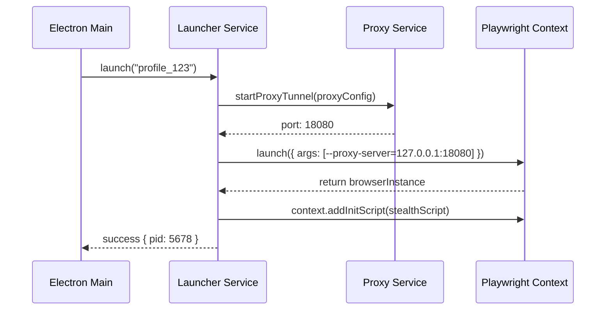

# Launcher Service Specification

This service controls the browser execution lifecycle, process tree bindings, and runtime cleanup.

---

## 1. README (Purpose)
Provides methods for spawning faked Playwright contexts, setting CLI arguments, monitoring process exits, and releasing proxy sockets when browsers shut down.

---

## 2. Architecture
```text
Electron IPC Handler ➔ LauncherService
                       ├── Prepare Profile Configuration
                       ├── Start Local HTTP/Socks Proxy Tunnel
                       ├── Playwright Spawner Engine
                       └── Process Watchdog Daemon (Tracks PID activity)
```

---

## 3. API (Interfaces)
```typescript
interface LauncherService {
  launch(profileId: string, options?: LaunchOptions): Promise<LaunchResult>;
  stop(profileId: string): Promise<void>;
  restart(profileId: string): Promise<LaunchResult>;
  getActiveSessions(): Map<string, ActiveSession>;
}
```

---

## 4. Sequence (Launch Process)


---

## 5. Testing
*   **Leak Test**: Assert that the browser process terminates completely and releases ports when the window is closed.
*   **Zombie Audit**: Assert that if Chromium crashes, the proxy tunnel is shut down.
