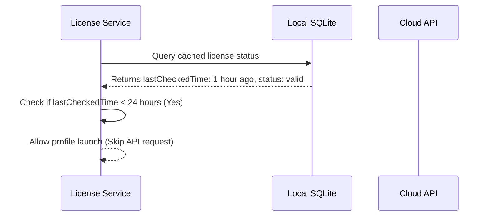

# License Service Specification

This service manages client authentication, license validations, and offline grace period clocks.

---

## 1. README (Purpose)
Validates license key states on profile startup, gates access to premium limits (e.g. max active profiles), and manages local token refreshes.

---

## 2. Architecture
```text
Launcher (Start profile) ➔ LicenseService
                              ├── Local SQLite cache audit
                              ├── Cloud API validation fallback
                              └── Offline grace period countdown (48 hours)
```

---

## 3. API (Interfaces)
```typescript
interface LicenseService {
  validateLicense(key: string, machineId: string): Promise<LicenseState>;
  getLicenseStatus(): Promise<LicenseStatus>;
  checkLimits(activeProfileCount: number): Promise<boolean>;
  refreshSession(): Promise<void>;
}
```

---

## 4. Sequence (Validation Flow)


---

## 5. Testing
*   **Grace Period test**: Verify profile launch is allowed when the API is unreachable but the offline grace clock is under 48 hours.
*   **Limits test**: Verify that exceeding the profile creation limit returns an access restriction error.
