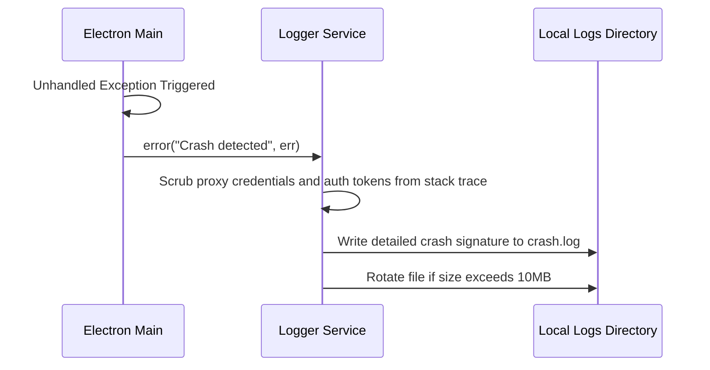

# Logger Service Specification

This service manages system logging, log files rotations, crash dumps, and security scrubbing.

---

## 1. README (Purpose)
Provides categorized logs (app, launcher, proxy, crash) to simplify debugging for Support agents, applying daily file rotations.

---

## 2. Architecture
```text
System Action ➔ Logger Service ➔ Winston Rotate Transport
                                   ├── Info Level (app.log)
                                   ├── Debug Level (proxy.log)
                                   └── Exception Level (crash.log)
```

---

## 3. API (Interfaces)
```typescript
interface LoggerService {
  info(message: string, context?: string): void;
  debug(message: string, context?: string): void;
  error(message: string, error?: Error, context?: string): void;
  getLogPaths(): string[];
  cleanLogs(daysToKeep: number): Promise<void>;
}
```

---

## 4. Sequence (Exception Capture Flow)


---

## 5. Testing
*   **Rotation Test**: Verify that logs rotate correctly once file sizes exceed 10MB.
*   **Sanitization Test**: Verify that proxy passwords inside URLs are replaced with `[REDACTED]`.
