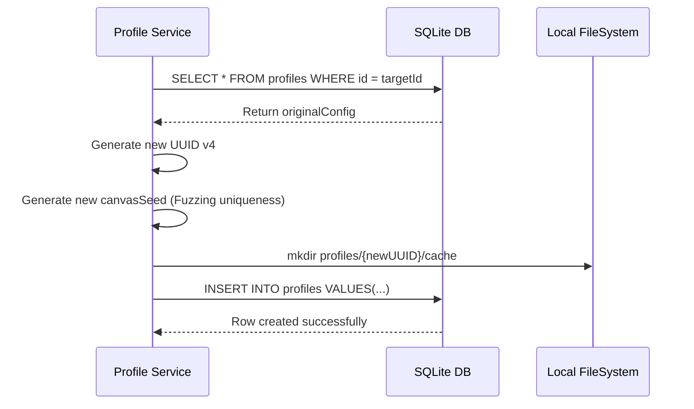

# Profile Service Specification

This service manages profile configuration parameters, directory setups, and data schema bindings.

---

## 1. README (Purpose)
Provides CRUD actions for profiles, allocations of isolated `--user-data-dir` folders on disk, and profile cloning presets.

---

## 2. Architecture
The Profile Service acts as the interface layer over the SQLite database driver and local file system:

```text
IPC Invocation  ➔  ProfileService Controller  ➔  SQLite (better-sqlite3)
                                              ➔  fs-extra (create userDataDir)
```

---

## 3. API (Interfaces)
```typescript
interface ProfileService {
  createProfile(dto: ProfileCreateDTO): Promise<Profile>;
  getProfile(id: string): Promise<Profile>;
  updateProfile(id: string, updates: Partial<Profile>): Promise<Profile>;
  deleteProfile(id: string): Promise<void>;
  cloneProfile(id: string): Promise<Profile>;
}
```

---

## 4. Sequence (Clone Flow)


---

## 5. Testing
*   **Unique Check**: Verify that cloning a profile generates distinct `canvasSeed` and `audioSeed` values.
*   **Cleanup Check**: Verify deleting a profile deletes both the database row and the file directories completely.
