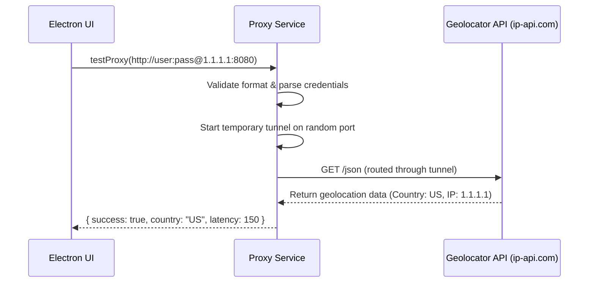

# Proxy Service Specification

This service manages proxy connection validations, network address translations, and authenticated credentials tunnels.

---

## 1. README (Purpose)
Enables connecting to SOCKS5/HTTP/HTTPS proxies that require credentials by starting a local non-authenticated forwarding tunnel.

---

## 2. Architecture
```text
Playwright Browser ➔ Local Proxy Tunnel (127.0.0.1:port)
                         ├── Dynamic Port Allocation
                         ├── Basic Authentication Injection
                         └── Forward socket bytes to Upstream Proxy (SOCKS5/HTTP)
```

---

## 3. API (Interfaces)
```typescript
interface ProxyService {
  startTunnel(config: ProxyConfig): Promise<TunnelInstance>;
  stopTunnel(port: number): Promise<void>;
  testProxy(config: ProxyConfig): Promise<ProxyTestResult>;
  validateFormat(url: string): boolean;
}
```

---

## 4. Sequence (Test Flow)


---

## 5. Testing
*   **Leak Check**: Verify that when the tunnel is closed, all socket connections are torn down.
*   **Credentials Check**: Verify that proxy logins with special characters inside passwords are parsed correctly.
