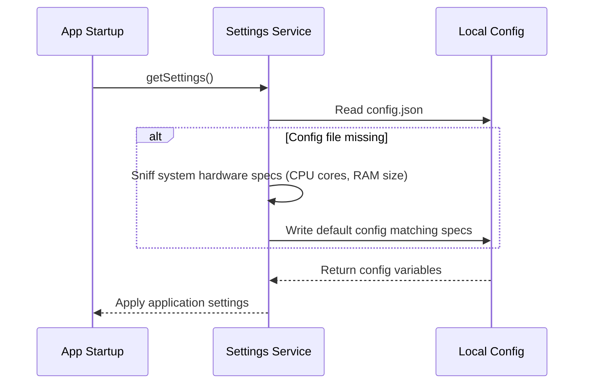

# Settings Service Specification

This service manages global application preferences, default values, and hardware capability limits.

---

## 1. README (Purpose)
Provides methods for loading, saving, and validation checks on application preferences (default proxy list, language setting, dark/light theme, custom browser runtimes paths).

---

## 2. Architecture
```text
SettingsService
 ├── Settings Schema (Validates settings key/value pairs)
 ├── JSON Config Storage (Saves configurations to disk)
 └── System hardware sniffer (Determines default resource parameters)
```

---

## 3. API (Interfaces)
```typescript
interface SettingsService {
  getSettings(): Promise<AppSettings>;
  updateSettings(settings: Partial<AppSettings>): Promise<AppSettings>;
  resetSettings(): Promise<AppSettings>;
  getHardwareSpecs(): HardwareSpecs;
}
```

---

## 4. Sequence (System Sniffing Flow)


---

## 5. Testing
*   **Default verification**: Verify that deleting the configuration file triggers system hardware checks and creates a new default configuration cleanly.
*   **Validation check**: Verify updating values checks properties constraints correctly.
