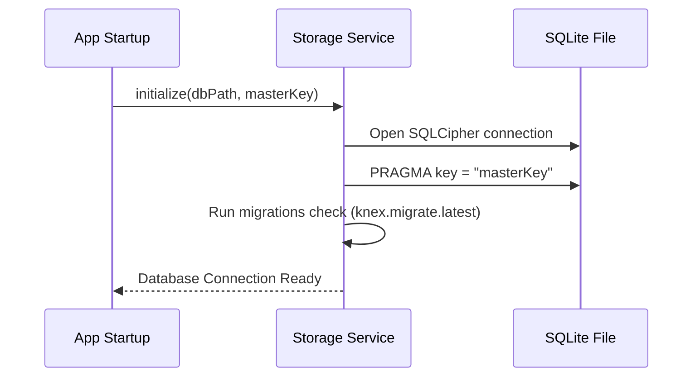

# Storage Service Specification

This service manages local database connections, SQLite queries execution, and file cache cleanup.

---

## 1. README (Purpose)
Provides a connection pool to the encrypted SQLite database (`profiles.db`), runs Knex migration schemas, and deletes old cache directories.

---

## 2. Architecture
```text
StorageService Controller
 ├── Knex instance (better-sqlite3-sqlcipher driver)
 ├── Cache folder cleaner (Scans profile directories size)
 └── Database backup manager (Creates daily snapshots)
```

---

## 3. API (Interfaces)
```typescript
interface StorageService {
  initialize(dbPath: string, key: string): Promise<void>;
  close(): Promise<void>;
  clearCache(profileId: string): Promise<void>;
  createBackup(targetPath: string): Promise<void>;
  restoreBackup(backupPath: string): Promise<void>;
}
```

---

## 4. Sequence (Startup Flow)


---

## 5. Testing
*   **Decryption test**: Verify database fails to open if an incorrect master key is provided.
*   **Disk Check**: Verify cache clearance deletes file folders but preserves profile configuration database rows.
