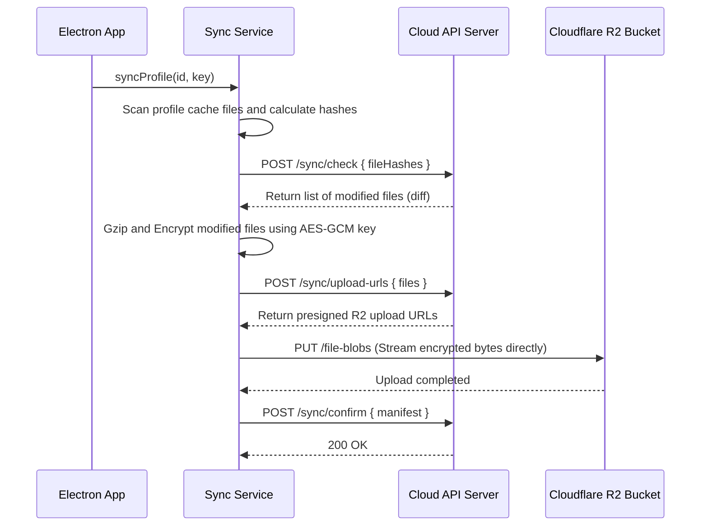

# Sync Service Specification

This service manages local-to-cloud profile database synchronizations, compression, and encryption.

---

## 1. README (Purpose)
Syncs profile cookies, localStorage metadata, and settings to cloud database servers using zero-knowledge client-side encryption.

---

## 2. Architecture
```text
Storage Changes ➔ Diff Manifest Scanner ➔ Brotli / Gzip Compressor
                     ➔ AES-GCM-256 Encrypter ➔ HTTPS Upload to Cloud S3/R2
```

---

## 3. API (Interfaces)
```typescript
interface SyncService {
  syncProfile(profileId: string, key: Buffer): Promise<SyncResult>;
  downloadProfile(profileId: string, key: Buffer): Promise<void>;
  checkLocalDiff(profileId: string): Promise<FileDiff>;
}
```

---

## 4. Sequence (Cloud Sync Flow)


---

## 5. Testing
*   **Zero-Knowledge validation**: Verify that S3 logs contain only ciphertext and verify that no decryption keys are sent to the Cloud API server.
*   **Resume verification**: Verify syncing recovers correctly from network interrupts.
