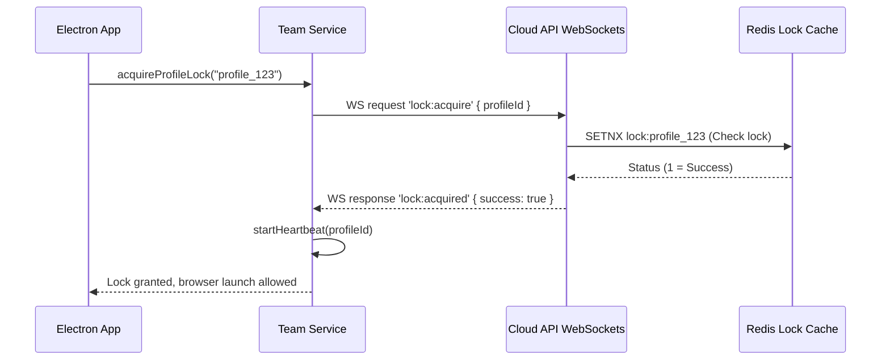

# Team Service Specification

This service manages workspace sharing configurations, user role validation, and profile locks.

---

## 1. README (Purpose)
Enables multi-user operations in shared workspaces, checking access roles, and preventing concurrent runs of identical profile sessions.

---

## 2. Architecture
```text
TeamService Controller
 ├── Permissions gate (Checks role mappings)
 ├── Heartbeat manager (Pings profile active status via WebSockets)
 └── Profile locks auditor (Releases locks when browser closes)
```

---

## 3. API (Interfaces)
```typescript
interface TeamService {
  getWorkspaceMembers(workspaceId: string): Promise<Member[]>;
  updateMemberRole(workspaceId: string, userId: string, role: string): Promise<void>;
  acquireProfileLock(profileId: string): Promise<boolean>;
  releaseProfileLock(profileId: string): Promise<void>;
  startHeartbeat(profileId: string): void;
  stopHeartbeat(profileId: string): void;
}
```

---

## 4. Sequence (Lock Acquisition Flow)


---

## 5. Testing
*   **Conflict test**: Assert that concurrent launch attempts from separate client machines block the second client.
*   **Heartbeat timeout test**: Verify that if a client crashes without releasing a lock, the cloud lock is released after 3 minutes of heartbeat silence.
