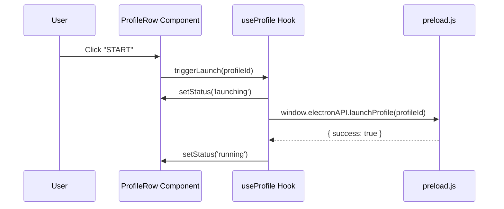

# UI Service Specification

This service controls the React dashboard interface rendering, component states, and user actions.

---

## 1. README (Purpose)
Provides a dark-themed (Midnight Style) dashboard for managing profiles, workspaces, and proxies.

### Component Index
*   **Sidebar**: Navigates between All Profiles, Workspaces, Proxies, Settings, and Billing panels.
*   **Toolbar**: Houses Search bar, Folder selectors, and tag filters.
*   **ProfileTable**: Displays the list of profiles, status badges, and action triggers.
*   **QuickCreate**: Fast profile generator popup.
*   **ProfileDetail**: Expanded sidebar for full fingerprint fine-tuning.
*   **ProxyDialog / FolderDialog**: Modals for configuring remote proxies and groups.

---

## 2. Architecture

The React rendering layout follows a strict component hierarchy:

```text
Dashboard (App Layout Container)
├── Sidebar (Navigation)
├── MainContent (Switchable Views)
│   └── ProfileView
│       ├── Toolbar (Search, Filter, Quick Create Button)
│       └── ProfileTable
│           ├── TableHeader
│           └── ProfileRow (One per profile)
│               ├── StatusBadge (stopped, running, launching)
│               ├── Actions (Start / Stop button)
│               └── InlineProxyInfo
└── Modals (CreateProfileModal, EditProxyModal)
```

---

## 3. API (Preload Context Bridges)
Exposed to React via `window.electronAPI`:
```typescript
interface UIServiceAPI {
  // Navigation triggering
  setTheme(theme: 'midnight' | 'light'): void;
  // UI Notifications pushing
  showToast(message: string, type: 'info' | 'error' | 'success'): void;
}
```

---

## 4. Sequence (UI Action Flow)


---

## 5. Testing
*   **Smoke Test**: Verify component grid layout scales correctly on 960px minimum width.
*   **Actions Test**: Verify click events block double-trigger calls while in the `launching` state.
