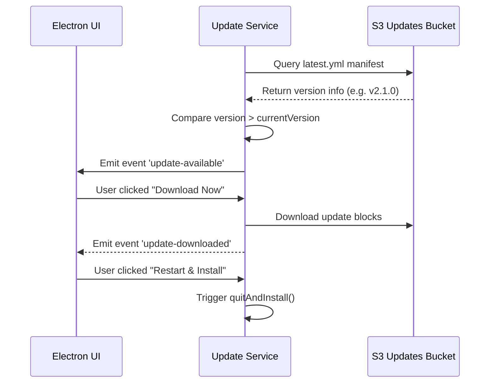

# Update Service Specification

This service manages desktop client auto-updates, background downloads, and differential installers.

---

## 1. README (Purpose)
Checks for new versions on startup, downloads updates in the background, and prompts restarts to apply installation setups.

---

## 2. Architecture
```text
UpdateService Controller
 ├── electron-updater client (Queries S3 updates bucket)
 ├── Background progress listener (Communicates progress to Renderer)
 └── NSIS installer execution hooks
```

---

## 3. API (Interfaces)
```typescript
interface UpdateService {
  checkForUpdates(): Promise<UpdateCheckResult>;
  downloadUpdate(): Promise<void>;
  installAndRestart(): void;
}
```

---

## 4. Sequence (Update Flow)


---

## 5. Testing
*   **Signature Test**: Verify that the application verifies signature keys before running updates.
*   **Offline Test**: Verify updater fails silently without crashing when the network is offline.
