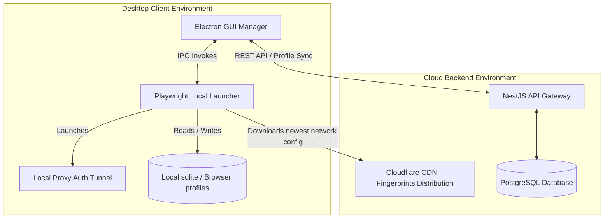
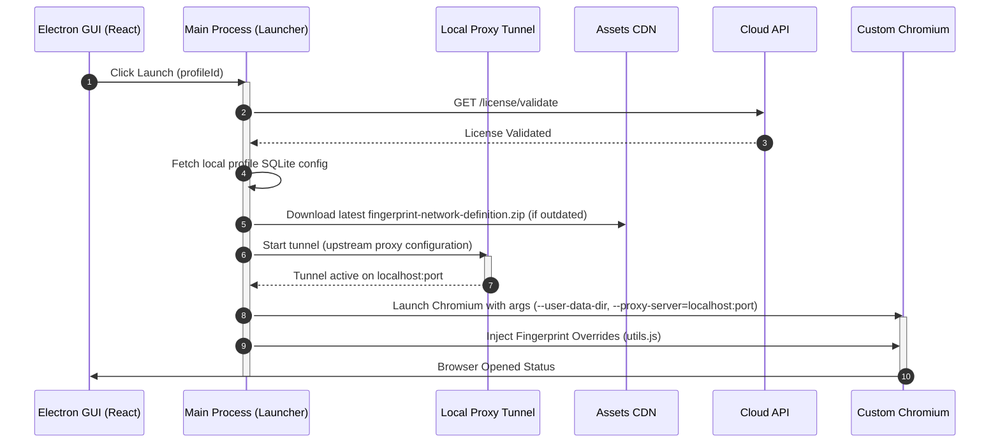

# System Architecture Specification

This document defines the structural architecture, component mapping, and interface boundaries of the overall system.

---

## 1. System Components Layout

The product system is partitioned into independent components, each communicating via strict contracts:

### Components Definitions
*   **Cloud API**: Stateless service handling users subscription checks (License) and encrypted cookie/localStorage synchronization.
*   **Desktop Client (Electron)**: Visual interface (Midnight theme) managing profiles.
*   **Local Launcher (Node/Playwright)**: Launches browsers locally, applying header orders and browser fingerprint overrides.
*   **Proxy Tunnel**: A local SOCKS5/HTTP tunnel handling proxy credentials to feed Playwright.
*   **CDN (Assets Distribution)**: Distributes compiled Bayesian Network CPT definitions zipped files.

---

## 2. Sequence Diagram (Full Session Lifecycle)

The sequence diagram below traces the communication from profile launch to page navigation:

---

## 3. Tech Stack
*   **Backend Server**: Node.js (NestJS) / Postgres / Redis (caching and queues).
*   **Desktop App**: Electron (v28.0.0+) / React / SQLite (via Knex.js).
*   **Stealth Engine**: Playwright / Puppeteer / generative-bayesian-network CPT files.
