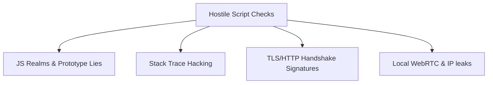

# System Security Specification

This specification documents the threat model, encryption standards, local storage safety, and browser sandboxing layout of the product.

---

## 1. Threat Model & Evasion Audits

The system operates in an environment where hostile client-side scripts run checks to uncover automation or inconsistent fingerprinted configurations.

### Targeted Security Protections
*   **Prototype Lies Redefinitions**: Redefine properties (like `navigator.webdriver` or `Notification.permission`) at the prototype level (e.g. `Navigator.prototype`) with correct property descriptors rather than assigning them directly onto instance objects.
*   **Hiding Proxy Footprints**: Intercept `Function.prototype.toString` to return standard native strings (`function () { [native code] }`) when query hooks are run against overridden APIs.
*   **Stack Trace Stripping**: Intercept caught errors inside proxy traps to erase execution frames of the injector library, mimicking native errors.

---

## 2. Cryptographic Specs & Session Protection

To protect user accounts, cookies, and local database storage from compromise:

### A. Local DB Encryption
*   **Database**: Local SQLite databases (`profiles.db`).
*   **Key Derivation**: Derive keys from user password strings using **Argon2id** (minimum parameters: $m=65536 \text{ KB}, t=3, p=4$) combined with a cryptographically secure random salt.
*   **Encryption**: SQLCipher module encrypts SQLite databases using **AES-256-GCM**.

### B. Sync Encryption (Zero-Knowledge)
*   Cookies and cache files are encrypted locally *before* they are sent to the Cloud API server.
*   The Cloud API server receives only encrypted binaries. The server has no access to the decryption key.

---

## 3. Sandboxing & Directory Isolation

*   Each profile is assigned a unique cache folder under `profiles/[profile_id]/cache/` which maps to `--user-data-dir`.
*   Chromium runs with sandboxing active (`--no-sandbox` is only recommended for restricted Linux Docker containers).
*   Browser cookies, indexDB, and localStorage files cannot be shared or queried between separate profiles.
