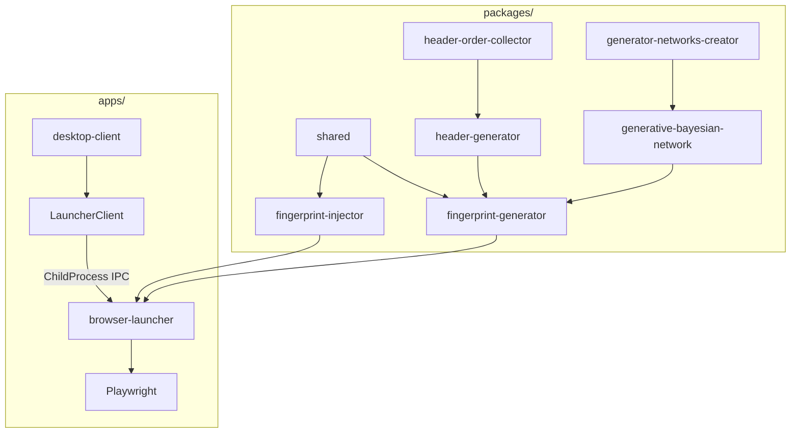

# Fingerprint Suite & Browser Launcher Codebase Architecture Guide

This document provides a comprehensive, highly detailed blueprint of the repository's architecture, including packages, test layouts, launcher integrations, and AdsPower CLI comparison. It is designed to enable agentic AIs to quickly grasp the codebase topology and reuse/extend its components safely.

---

## 1. Codebase Topology & Core Concepts

The repository is structured as a **PNPM Monorepo** separating core browser spoofing packages from the desktop client and launcher app:

### Core Architecture Philosophy
- **Mathematical Browser Spoofing**: Instead of hardcoding static User-Agent overrides, the project uses a **generative Bayesian network** trained on real-world browser attributes. This guarantees that generated attributes (e.g., matching GPU, screen size, header orders, and WebGL support) correspond to valid real-world configurations, avoiding heuristic detection.
- **Dynamic Context Injection**: Modifies browser variables in the runtime *prior* to page scripts execution. It prevents bot detection algorithms from reading automation indicators (like `navigator.webdriver`).
- **Launcher Decoupling**: The Electron UI (`desktop-client`) does not directly launch Playwright. It delegates execution to `browser-launcher` as a spawned child process, separating heavy browser automation and Node.js VM execution from the UI shell.

---

## 2. Packages Architectural Breakdown (`packages/`)

### A. `shared`
- **Purpose**: Holds the source-of-truth TypeScript definitions, enums, constants, and validation schemas.
- **Key Modules**:
  - `contracts/profile.ts`: Defines browser engine lists, distributions, platforms (`win32`, `darwin`, `linux`), runtime states, and the `ProfileRuntimeSessionSnapshot` payload structures.
  - `contracts/launcher.ts`: Contains the command-routing IPC request/response types (e.g., `LauncherCommand`, `LauncherResponse`, `LauncherErrorCode`).
- **Usage**: Imported by both `apps/browser-launcher` and `apps/desktop-client` to guarantee absolute type safety over process boundaries.

### B. `generative-bayesian-network`
- **Purpose**: Implements a mathematical Bayesian network solver that can model joint probability distributions of complex multidimensional datasets and perform sample queries.
- **How it works**:
  1. Loads a network structure (typically zipped JSON).
  2. Represents nodes as browser variables (e.g., OS, Browser Version, Screen Resolution).
  3. Samples values following probability tables, ensuring if OS is "macOS", the generated screen resolution matches realistic Apple screen ratios.
  4. Provides constraint propagation APIs (`utils.getConstraintClosure`) to filter possible values during generation (e.g., limiting resolution ranges).

### C. `header-generator`
- **Purpose**: Generates realistic HTTP request headers matching modern browser formats.
- **How it works**:
  - Contains database tables for headers ordering, default headers per browser, and user agent distributions.
  - Randomizes request headers (e.g. `sec-ch-ua`, `accept-language`, `user-agent`) while maintaining correct header ordering (e.g., connection headers, caching, encoding) matching the browser type.

### D. `fingerprint-generator`
- **Purpose**: Combines Bayesian network sampling with header generation to output a comprehensive `BrowserFingerprintWithHeaders` object.
- **Key Files**:
  - [fingerprint-generator.service.ts](file:///c:/Users/Phucx/Desktop/fingerprint-suite/packages/fingerprint-generator/src/services/fingerprint-generator.service.ts): Inherits from `HeaderGenerator`. Loads `fingerprint-network-definition.zip` into memory, runs the sampler, propagates user constraints (like screen size boundaries), and outputs a combined fingerprint envelope.
- **Output Structure**:
  - `headers`: Clean, ordered HTTP request headers.
  - `fingerprint`: Details such as `screen` dimensions, `videoCard` (WebGL vendor/renderer), `audio` context details, `fonts`, and `navigator` values.

### E. `fingerprint-injector`
- **Purpose**: Injects the generated fingerprint values into the target browser runtime to mask properties dynamically.
- **Key Files**:
  - `src/utils.js`: Client-side scripts written in vanilla JavaScript that execute in the browser window context. These override properties like `navigator.userAgent`, `navigator.userAgentData`, WebGL rendering context parameter getters, battery API getters, Intl locale, and hide automated webdrivers.
  - [fingerprint-injector.service.ts](file:///c:/Users/Phucx/Desktop/fingerprint-suite/packages/fingerprint-injector/src/services/fingerprint-injector.service.ts): Reads `utils.js` and builds a combined string script using `getInjectableScript(fingerprint)`.
- **Usage**: Playwright runtime adapter runs this script inside the browser context using `context.addInitScript()` before page loading.

### F. `header-order-collector` & `generator-networks-creator`
- **Purpose**: Utilities to rebuild the Bayesian network zip files from crawled raw browser logs, collecting and training header ordering constraints.

---

## 3. Applications & Main Services (`apps/`)

### A. `browser-launcher` (TypeScript Node Process)
Runs as an isolated child process spawned by the Electron Main. Receives IPC commands to launch or stop browsers.
- **Bootstrap Flow**:
  1. Entrypoint `index.ts` instantiates `CommandRouter`, `BrowserRuntimeRegistry`, and `BrowserLaunchOrchestrator`.
  2. Awaits registry initialization (parses `runtimes.json` into a fast Map-based index cache).
  3. `CommandRouter` listens for parent process IPC messages via `ProcessTransport`.
- **Launch Pipeline**:
  - `BrowserLaunchOrchestrator` receives payload -> Uses `BrowserExecutableResolver` to get the path of a trusted binary -> Calls `RuntimeCompatibilityChecker` to verify host compatibility (e.g. platform/architecture policy checks) -> Builds the `BrowserLaunchPlan` -> Spawns Playwright via `PlaywrightProcessLauncher`.
- **Readiness Verification**:
  - Before marking a launched session "ready", `ReadinessChecker` opens a silent page, evaluates screen sizes, locales, and looks for the injected fingerprint marker script to ensure spoofing is active and has not been bypassed.

### B. `desktop-client` (Electron UI Client)
- **IPC bridge**: `LauncherClient` (singleton service) manages the spawned `browser-launcher` child process. It supports request correlation, command timeouts, and automatic lock recovery.
- **Database Layer**: SQLite/Knex stores local profiles, proxies, and session logs.
- **Session Recovery**:
  - On application startup, `recoverCrashedSessions()` inspects the local database. If a profile was marked active but its session lock file (`session.lock`) is stale (and the owner process ID is no longer alive), it cleans up the lock and marks the session as `crashed` safely.

---

## 4. Test Infrastructure (`test/` and `src/__tests__/`)

The project houses a robust multi-layered testing layout:

1. **Unit Tests (`apps/browser-launcher/src/__tests__`)**:
   - `runtime-compatibility.unit.test.ts`: Asserts manifest reader validations, duplicate path checks, architecture compatibility policy checks, and exit warning checks.
   - `launcher-pipeline.unit.test.ts`: Verifies end-to-end command routing, launch plan construction, and session shutdown.
2. **Integration Tests (`apps/desktop-client/src/main/services/__tests__`)**:
   - Tests `LauncherClient` process lifecycle, database migration state validation, and SQLite repository transactions.
3. **Antibot Validation & Benchmarks (`test/antibot-services`)**:
   - [cloudflare.ts](file:///c:/Users/Phucx/Desktop/fingerprint-suite/test/antibot-services/live-testing/cloudflare.ts): End-to-end bot detection testing. Launches spoofed browsers and routes them to real Cloudflare-protected pages (like Turnstile/Challenged endpoints) to output a browser validation report (`report.html`) detailing bypass rates.

---

## 5. Comparison: Custom Launcher vs. AdsPower Browser CLI

The repository includes a skill guide for [adspower-browser](file:///c:/Users/Phucx/Desktop/fingerprint-suite/.agents/skills/adspower-browser/SKILL.md) which operates the AdsPower Local API. Here is how they compare:

| Property | AdsPower Browser (CLI/MCP) | Custom `browser-launcher` |
| --- | --- | --- |
| **Source Model** | Closed-source commercial browser shell. | Open-source modular Chromium-Playwright pipeline. |
| **Orchestration** | Launches AdsPower app headless wrapper via API Key. | Directly spawns NodeJS child processes routing standard CDP. |
| **Registry Management** | Built-in kernel downloads and AdsPower Client patch updates. | Explicit JSON Manifest mapping (`runtimes.json`) with compatibility filters. |
| **Fingerprint Engine** | Native C++ level fingerprint masking in browser core. | JS-level injection (via `fingerprint-injector` scripts) at context initialization. |
| **Proxy Integration** | Internal AdsPower proxy manager. | Custom NodeJS tunnels (SOCKS/HTTP) passed directly to Playwright launcher args. |

---

## 6. Guidelines for AI Agents & Developers

When making edits or adding features, always adhere to these rules:

1. **Maintain Zero 'any' Casting**:
   - Leverage strong TypeScript types. If raw data needs runtime verification, write a type guard or cast to `unknown` first.
2. **Reuse Shared Typings**:
   - Never duplicate inline definitions for distributions (`chrome`, `brave`, etc.), channels, or architectures. Always import from the `shared` contract libraries.
3. **Keep Path Resolvers Portable**:
   - Always verify absolute paths using `path.posix.isAbsolute` and `path.win32.isAbsolute` rather than custom regex.
4. **Debounce Timer Cleans**:
   - When using timers for database writes or timeouts, store their types as `ReturnType<typeof setTimeout>` and clean them up during process exits or restarts.
